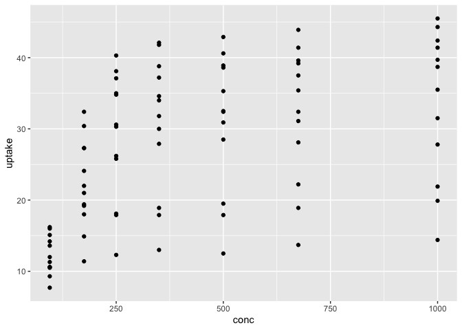
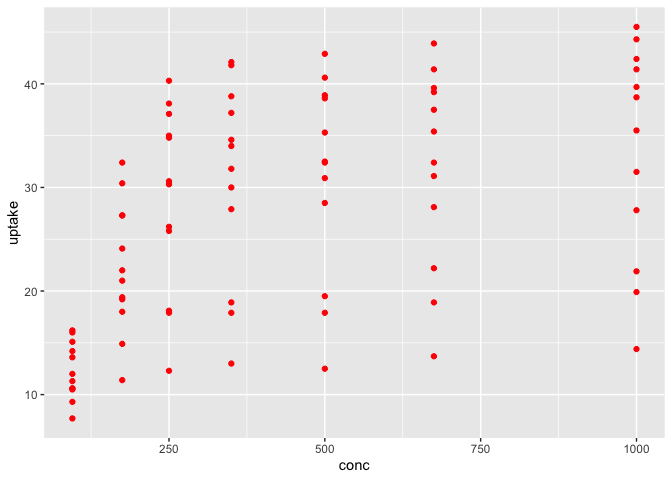
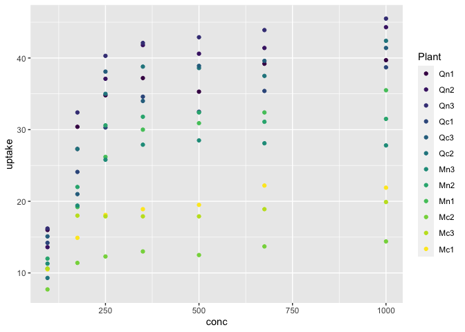
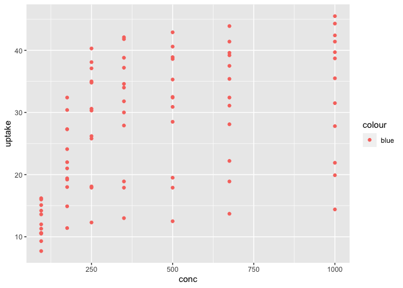
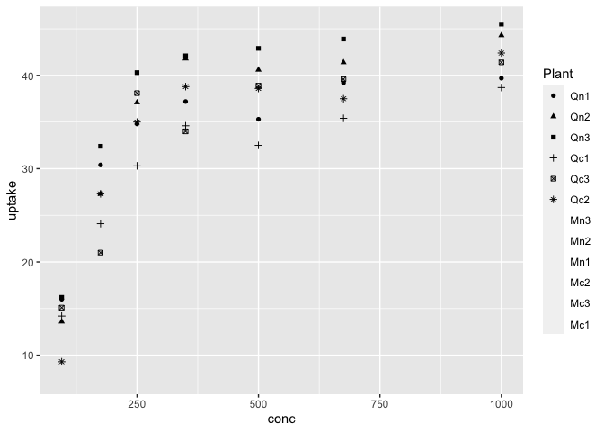
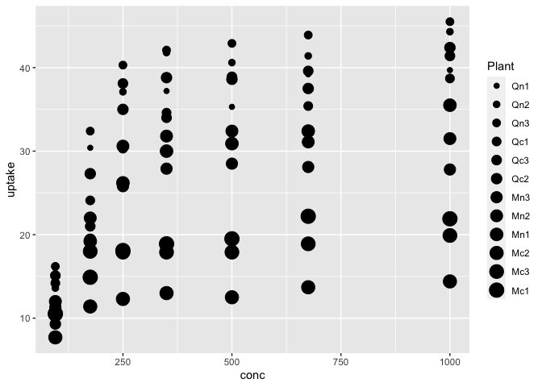
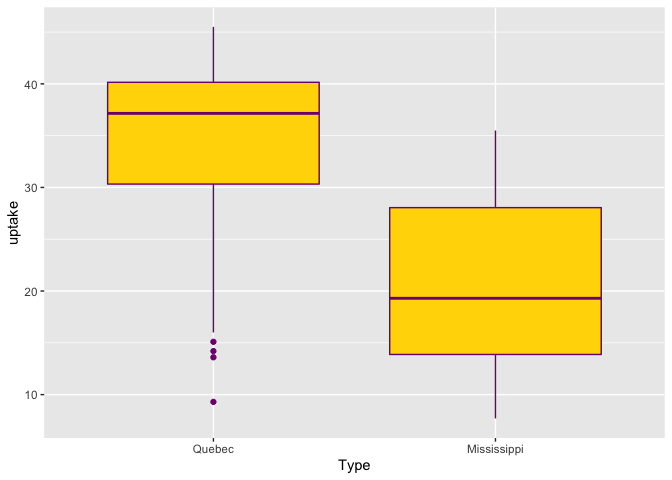
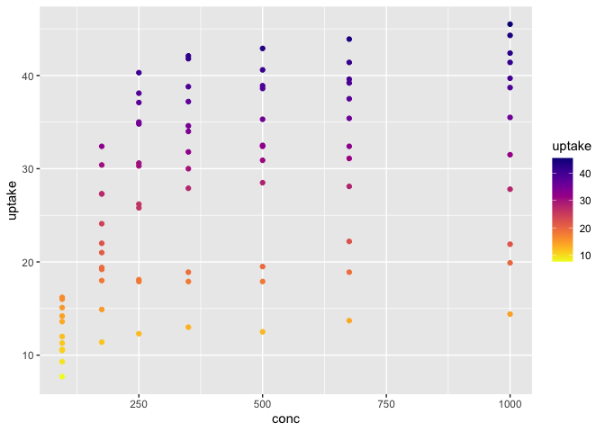
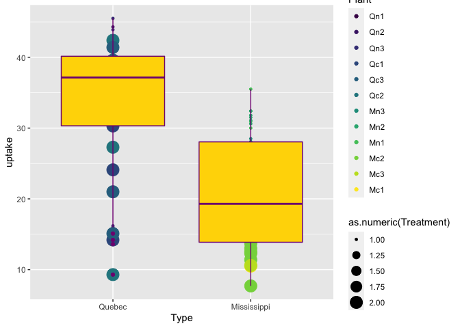
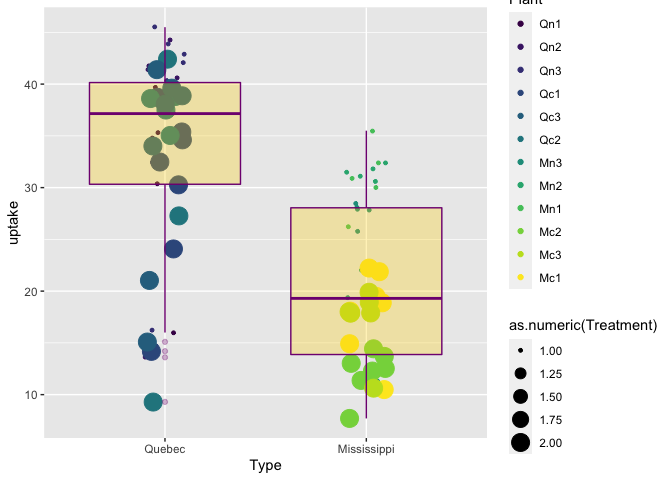

ggplot2: Introduction
================
ggSeminar
Fall 2021

### Why `gg`?

-   *The Grammar of Graphics* (1999), Leland Wilkinson
-   Not about plotting, but about the theory of graphics
-   The book came before `ggplot` and describes the system that
    underlies `ggplot` (and other graphical programs)
-   Much like writing or data analysis, graphical construction has rules
    and conventions

**We tend to think top down about a graphic**

<div class="figure">


<p class="caption">
Ridgeplot by Claus O. Wilke
</p>

</div>

**The gg approach is to think bottom up about the construction of a
graphic**

<div class="figure">


<p class="caption">
Ridgeplot by Claus O. Wilke
</p>

</div>

Neither top down or bottom up alone is bad. In reality, the best data
visualists see things both way. As you develop as a data visualist you
will learn to see things from the bottom up and understand their
construction, while also knoing that most viewers will just see the top
down and need to get the message in a matter of a few seconds.

## The Layers

### Data

-   Tidy format: variables are columns and observations are rows

### Aesthetics

-   Mapping the variables in the data to visual properties (typically of
    geoms)
-   `geom_point(size = 2)` is not an aesthetic and makes all points the
    same size
-   `geom_point(aes(size = count))` is an aesthetic and makes all points
    proportional in size to the `count` variable
-   `geom_boxplot(aes(fill = Month))` is an aesthetic and colors all
    boxplots in relation to the `Month` variable

### Geometries

-   Combines data, aesthetics, and geometric object (and possibly also a
    statistical transformation and other adjustments) to plot
-   `geoms` are the specific geometries that often give a plot its type
    -   `geom_bar()` = barplot
    -   `geom_point()` = scatterplot
    -   `geom_boxplot()` = boxplot
    -   plus many others

### Facets

-   Generates small multiples for subsets or groups of data
-   Faceting is powerful and useful, but is mapped to the data
-   (We will cover layouts and multipanel plots later, which differ from
    faceting because paneling can be entirely different objects)

### Statistics

-   Simple `geoms` like points display data very straightforwardly, but
    often we want to display some statistical aspect of the data (often
    along with the data)
-   For example, a boxplot is not data, it is showing the statistics
    (distributional) moments of some data
-   Some `geoms` alone present statistics, but often there are
    statistical options (arguements) within `geoms` that allow for
    statistical treatment of the data to be plotted

### Coordinates

-   Define the plotting surface or layout
-   Interpret the variables that are mapped, scaled, and adopt a
    geometry
-   Sounds like it should only apply to maps, but whether latitude and
    longitude or *x* and *y*, your plot likely has coordinates that
    define the place where the data and statistics are placed
-   You often can use the default coordinates, but they can also be very
    useful to modify, manipulate, rotate, and scale

### Theme

-   Fine control over the non-data elements of the plot; for example,
    fonts, ticks, panel strips, and background
-   Themes can be manipulated by specific components (called `elements`
    and their associated `element function`) or you can adopt complete
    themes that modify multiple aspects of the plot

#### Building a `ggplot`

Keep in mind - Layer order/sequence can matter! - Some specifications
can be put in different places with little change - Some specifications
can be put in different places with big change - `qplot()` can be used
for quick plotting operations, but is not covered here - We always start
with the `ggplot()` function and then add to it. - Add layers together
with the addtion sign, `+`

## Global vs. local data and mapping

*Disclaimer: I recommend modifying the default theme (for a number of
reasons we will cover later), but because we need to cover other basics
before themes, we will work with the default theme for now.*

-   Here we put the data and (mapped) variables into the `ggplot()`
    function, which means they are **global** and will be applied to
    subsequent layers.
-   The `geom_point()` layer adds points calling the data and variables
    from their global position

``` r
library(tidyverse)
ggplot(data = CO2,
       mapping = aes(x = conc, y = uptake)) +
  geom_point()
```

<!-- -->

We can also omit the left side of the arguements, which is the case for
just about any function argument in R. As you get comfortable in
`ggplot` you may omit argument labels, but I encourage you to get in the
habit of using them.

``` r
# Same plot as above
ggplot(CO2, aes(x = conc, y = uptake)) +
  geom_point()
```

<!-- -->

There may be cases where you want the data to be global, but the
variables to be local. Such a case may exist where you are using the
same dataframe, but different layers visualize different variables.
Mapped variables can be specified in layers assuming they are in the
global data. In the example below, any additional layers will call on
the `CO2` data, but will then need their variables specified locally.

``` r
# Same plot as above
ggplot(data = CO2) + # global data
    geom_point(mapping = aes(x = conc, y = uptake)) # local variables
```

<!-- -->

You are also able to map everything locally. This can be useful when
needed, but is not as common as global mapping and will require more
code (and more chances for mistakes).

``` r
# Same plot as above
ggplot() + # nothing global
    geom_point(data = CO2, # all local
               mapping = aes(x = conc, y = uptake))
```

<!-- -->

Note that the above four variants in the code all produced the same
plot. This is ultimately a good thing because it shows flexibility, but
can also be confusing when starting.

As an aside, your plots can be assigned to an object, which may be
useful later (such as when you are combining plots).

``` r
p1 <- ggplot(data = CO2,
             mapping = aes(x = conc, y = uptake)) +
      geom_point() 
```

#### Aesthetics

Aesthetics can be confusing at first, but eventually make sense and are
very powerful ways to connect (map) data to visuals. Let’s work with
color as an example aesthetic.

### Color

In the example below, we want all points to be red. In this case, we do
not need to map color to an aesthetic, because the red color is not
connected to anything in the data. The `color` argument goes outside the
aesthetic argument when color is not mapped to a variable.

``` r
ggplot(data = CO2) +
    geom_point(mapping = aes(x = conc, y = uptake), 
               color = "red") # outside the aesthetic, aes()
```

<!-- -->

Often we will want color or some other visual feature to be mapped to a
variable, such that it encodes information. By placing the `color`
argument inside the aesthetic and specifying the variable we want the
color to represent, we give color a whole new meaning. (Also, note that
because the `CO2` data is mapped gobally, local variables do no need to
specify the data frame and can be invoked with only their name.)

``` r
ggplot(data = CO2) +
    geom_point(mapping = aes(x = conc, y = uptake, color = Plant)) 
```

<!-- -->

When color is mapped to a variable, we get a few things automatically.
First, we get a default color scheme. This can be easily modified later
with additional commands. We also get a legend, which `ggplot` assumes
you will want in order to translate the information in the colors to
what they show. Legends are also easily manipulated and modified, but
for now we will just stick with the defaults.

Below is an example of when you confuse the above color arguments. What
you are telling `ggplot` here is that color is an aesthetic, but giving
it the information of `"blue"`. The results are nonsense because the
points are red because that is the default first color and there is not
`"blue"` in the data to be mapped to.

``` r
ggplot(data = CO2) +
    geom_point(mapping = aes(x = conc, y = uptake, 
                             color = "blue"))
```

<!-- -->

### Size and Shape

Aesthetics can map features other than color, such as size and shape.

``` r
ggplot(data = CO2) +
    geom_point(mapping = aes(x = conc, y = uptake, shape = Plant)) 
```

    ## Warning: Using shapes for an ordinal variable is not advised

    ## Warning: The shape palette can deal with a maximum of 6 discrete values because
    ## more than 6 becomes difficult to discriminate; you have 12. Consider
    ## specifying shapes manually if you must have them.

    ## Warning: Removed 42 rows containing missing values (geom_point).

<!-- -->

``` r
ggplot(data = CO2) +
    geom_point(mapping = aes(x = conc, y = uptake, size = Plant)) 
```

<!-- -->

However, there are problems with both of these aesthetics (note the
Warnings produced!). In the example with `shape`, there are fewer
default shapes than there are factors of `Plant`. Additional
modification of the shapes would need to take place, or consider if
shapes would need to differ by plant. Although the `size` aesthetic
mapped correctly, there is a more subtle problem here. The size of the
points increases with each factor and shape size is often cognitively
interpreted as a quantity. Yet there is no quantitative information
coded into the `Plant` variable. (In other words, the human brain may
very likely interpret that plant `Mc1` is somehow greater than, for
example, `Qn1`. Yet there is nothing greater or less than about the
plants.)

## Color vs Fill

You may be using a geometry other than `geom_point()` and wonder why
color is not being applied as you expect. The answer lies in the
geometry type. Generally speaking there are three types of geometry (not
`geoms`!): points, lines, and polygons. `geoms` that are points and
lines can only take one type of color. However, polygons can take two
types of color: the `fill` is the color that fills in the object and the
`color` is the color that applies to the (out)lines of the object. See
the below `geom_boxplot()` as an example of fill vs color (not applied
as an aesthetic).

``` r
# Note use of hex codes for yellow and purple
ggplot(data = CO2) +
  geom_boxplot(mapping = aes(x = Type, y = uptake),
               color = "#800080", fill = "#FFD700")
```

<!-- -->

### Scales

Another important aspect of mapping aesthetics is whether the variables
you are representing are discrete or continuous. Simple coding a
variable to `color` may work correctly, but may not give you the desired
color or color scheme you want. This is where `scales` can be added to
modify the aesthetics.

In the code below we have loaded the `viridis` library (a popular
library for colors) and added a scale that tells the plot we want our
continuous variable `uptake` colored with the `plasma` color map in
reverse order (coded by `option = "C"` for `plasma` and `direction = -1`
for reverse; see the function help for the option descriptions). Also
note that we would typically not encode color for a variable that is
already mapped to an axis because this is duplicate information.

``` r
library(viridis)
ggplot(data = CO2) +
    geom_point(mapping = aes(x = conc, y = uptake, 
               color = uptake)) +
  scale_color_viridis(option = "C", direction = -1)
```

<!-- -->

There are dozens of `scale` functions that can be used in various plots
to achieve various features. Cover all of them is beyond the scope of
this overview, but expect to look into scales more as needed.

#### Layering

As mentioned above, some `ggplot` layers will be read sequentially,
meaning that how you organize your code matters. As an example, it is
often a good idea to show both your data and any statistics or summaries
you include. Often you want the inferences that a statistical summary
provides, but the nuances of the data can also reveal information.
`ggplot` provides an easy way of layering multiple visuals when needed.

``` r
ggplot(data = CO2) +
  geom_point(mapping = aes(x = Type, y = uptake,
                           color = Plant, 
                           size = as.numeric(Treatment))) +
  geom_boxplot(mapping = aes(x = Type, y = uptake),
               color = "#800080", fill = "#FFD700") 
```

<!-- -->

This is a good start, but needs some work. Ignoring the thematic and
legend improvements we might want, the boxes are covering up the points
and some of the points are overlapping each other.

It is typically a good idea to show data as the bottom layer, but it is
also not required. We can keep the data as the bottom layer if we make
the boxes a bit more transparent. And we can spread the points out a
little by jittering them, which technically moves them off thier exact
*x*-value, but should not compromise the message given the improved
readability.

In the code below, note the use of `geom_jitter()` to jitter the points,
the `width=` argument to control the amount of jitter, and the `alpha=`
argument to control the transparency.

``` r
ggplot(data = CO2) +
  geom_jitter(mapping = aes(x = Type, y = uptake,
                           color = Plant, 
                           size = as.numeric(Treatment)),
              width = 0.1) +
  geom_boxplot(mapping = aes(x = Type, y = uptake),
               color = "#800080", fill = "#FFD700",
               alpha = 0.3)
```

<!-- -->
