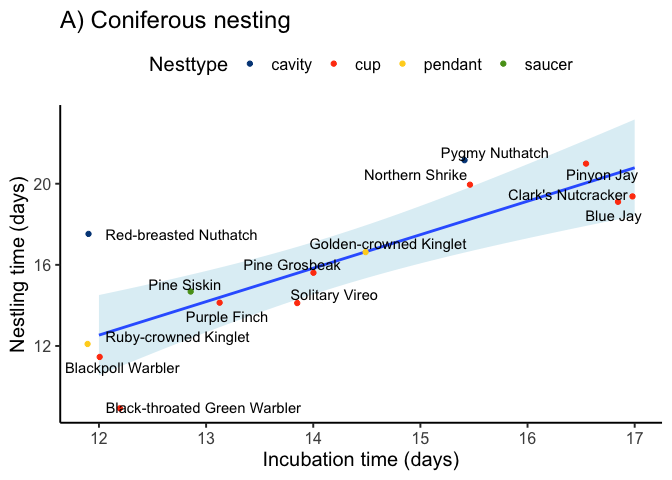

ggplot2: geoms
================
ggSeminar
Fall 2021

## Geoms

`geoms` are the geometries that combines data, aesthetics, and a
geometric object (and possibly also a statistical transformation and
other adjustments) to plot as a layer. `geoms` are the specific
geometries that often give a plot its type; for example, a bar plot is a
generic expression that can be operationalized with a bar geom, or
`geom_bar()`

There are two considerations when needing a `geom` for a `ggplot`.

1.  What is the data or information you want to visualize? Note that
    this question is independent of `ggplot` because there may be
    multiple correct types of geometries and the answer lies within the
    type of data and information you want to share. For example, are you
    seeking to visualize counts (accumulations), distributions, *x*-*y*
    relationships, or something else?

2.  After you have identified the correct type of geometry, what is the
    correct or optimal `geom()` for your needs?

#### A few miscellaneous notes about `geoms`

-   Note that Claus O. Wilke’s book, [Fundamentals of Data
    Visualization](https://clauswilke.com/dataviz/), is an excellent
    overview of data visualization in general and we will adopt some of
    his structure when thinking about `geoms`
-   The examples below scratch the surface of what `geoms` can do;
    however, I have tried to idenfity the most common `geoms` and how
    they are typically used
-   We will cover themes later, but below I have added a classic theme
    (`theme_classic(base_size = 15)`) to each plot only because I think
    it makes the output cleaner and simpler

### Amounts

#### When to use

-   When you want to plot the magnitude of something
-   Often data resulting from counts or accumulations
-   Use when your data has *one* value you need to display

#### Cautions

-   When you have uncertainty around a value
-   Stacked bar plots are generally a poor choice, unless for
    proportions
-   When you have groups in your data, you need to prioritize the
    compari son (within or among?)
-   [“Within-the-bar
    bias”](https://link.springer.com/article/10.3758/s13423-012-0247-5)

#### Examples

`geom_bar()` makes the height of the bar proportional to the number of
cases in each group. With `geom_bar()` you are not plotting a variable
in a column, but rather telling `ggplot` which variable you want it to
tabulate and then plot.

``` r
library(tidyverse)
library(Stat2Data)
data(BirdNest)
head(BirdNest)
```

    ##                     Species                     Common Page Length Nesttype
    ## 1         Tyrannus tyrannus           Eastern Kingbird  360   20.0      cup
    ## 2 Myiodynastes luteiventris Sulphur-bellied Flycatcher  368   20.0   cavity
    ## 3     Myiarchus cinerascens     Ash-thoated Flycatcher  372   20.0   cavity
    ## 4      Myiarchus tyrannulus   Brown-crested Flycatcher  372   22.5   cavity
    ## 5     Myarchus tuberculifer    Dusky-capped Flycatcher  374   17.0   cavity
    ## 6           Sayornis phoebe             Eastern Phoebe  378   17.0      cup
    ##   Location No.eggs Color Incubate Nestling Totcare Closed.
    ## 1    decid     3.5     1     17.0     17.0    34.0       0
    ## 2    decid     3.5     1     15.5     17.0    32.5       1
    ## 3    decid     4.5     1     15.0     15.0    30.0       1
    ## 4    decid     4.5     1     14.0     16.5    30.5       1
    ## 5    decid     4.5     1     14.0     14.0    28.0       1
    ## 6   bridge     4.5     0     16.0     15.5    31.5       0

``` r
ggplot(data = BirdNest) +
    geom_bar(mapping = aes(x = Location)) +
    theme_classic(base_size = 15) # note this theme change for clarity
```

<!-- -->

We can stack with information by using the `fill=` aesthetic to specify
another variable.

``` r
ggplot(data = BirdNest) +
    geom_bar(mapping = aes(x = Location, fill = Nesttype)) +
    theme_classic(base_size = 15) # note this theme change for clarity
```

<!-- -->

However, this type of plot is not recommended because it is very hard
for a viewer to interpret. For example, how many counts are there of the
crevice nest type on the ground location? Any segments that are not
starting at 0 require the viewer to do some guesswork, which can be very
hard and take away from your message.

One solution is to use the `dodge` argument to place grouped bars next
to each other and not on top of each other.

``` r
ggplot(data = BirdNest) +
    geom_bar(mapping = aes(x = Location, fill = Nesttype),
             position = "dodge2") +
    theme_classic(base_size = 15) # note this theme change for clarity
```

<!-- -->

The above dodged bar plot is better, but could still be hard to
interpret. (What is the message from the data?)

Another solution is to use a proportional bar chart, in which each bar
represents 100% of that group, segmented into the subgroups.

``` r
ggplot(data = BirdNest) +
    geom_bar(mapping = aes(x = Location, fill = Nesttype),
             position = "fill") +
    scale_y_continuous(labels = scales::percent) + # Consider this line
    theme_classic(base_size = 15) # note this theme change for clarity
```

<!-- -->

However, a concern with the proportional bar plot is that we lose the
information about frequency (sample size). In other words, the above bar
plots clearly conveyed that a group like `deciduous` had a lot of
observations, while a group like `building` had few. This information is
lost, and as a result, two different groups each with a subgroup
representing 10% tells us nothing about the sameple size. One solution
to this issue is to modify the `width` aesthetic of the bars to be
proportional to the sample size (not shown here).

We will talk about small multiples more later, but one other option is
to give each group its own panel.

``` r
ggplot(data = BirdNest) +
    geom_bar(mapping = aes(x = Nesttype)) +
    theme_classic(base_size = 15) + # note this theme change for clarity
    facet_wrap(~Location) 
```

<!-- -->

If you want bars to represent values that are already in the data, use
`geom_col()`.

For example, maybe we want to compare the `Nesttype = spherical` to see
if bird species with spherical nests had different numbers of eggs.

``` r
filter(BirdNest, Nesttype == 'spherical') %>%
ggplot() +
    geom_col(mapping = aes(x = Common, y = No.eggs)) +
    theme_classic(base_size = 15)  # note this theme change for clarity
```

<!-- -->

### Distributions

#### When to use

-   Typically used when you have a collection of values that comprise a
    distribution
-   Useful when you want to show all the data and/or highlight the shape
    of the data
-   Often good for showing a central tendency and variation

#### Cautions

-   Here, the word *distribution* is used generically to refer to a
    collection of data points and how they are distributed across a
    range of values; your data may or may not represent a specific
    probability distribution
-   Distributions are often visualized as raw data or summarized data;
    know the difference and why you would use one or the other

#### Examples

Much like `geom_bar()`, `geom_histogram()` simply requires the one
variable you would like to represent. The `geom_histogram()` function
will bin those values for representation. Let’s say we want to visualize
the distribution of the variable `Incubate`; in other words, we want to
see how frequent different incubation periods are, or maybe whether
there is a specific shape to the distribution of the data.

``` r
ggplot(BirdNest, aes(x = Incubate)) +
    geom_histogram() +
    theme_classic(base_size = 15)  # note this theme change for clarity
```

    ## `stat_bin()` using `bins = 30`. Pick better value with `binwidth`.

    ## Warning: Removed 1 rows containing non-finite values (stat_bin).

<!-- -->

This looks good, but we get a message that the default bin width of 30
might not be ideal. Bins are simply the intervals in which the values
are grouped. For larger sample sizes over wider ranges of values, we
often want more bins. For smaller sample sizes over narrower ranges of
values, we often want fewer bins. Both arguments `bins=` and `binwidth=`
can modify the number of bins.

``` r
ggplot(BirdNest, aes(x = Incubate)) +
    geom_histogram(bins = 8, color = 'white', fill = 'black') +
    theme_classic(base_size = 15)  # note this theme change for clarity
```

    ## Warning: Removed 1 rows containing non-finite values (stat_bin).

<!-- -->

A density plot is another good tool for distribution visualization. A
density plot is essentially a smoothed histogram, which may result in
some loss of detail but often improves the overal shape of the
distribution.

``` r
ggplot(BirdNest, aes(x = Incubate)) +
    geom_density(fill = 'lightblue', color = 'darkblue') +
    theme_classic(base_size = 15)  # note this theme change for clarity
```

    ## Warning: Removed 1 rows containing non-finite values (stat_density).

<!-- -->

Often you will want to plot distributions to compare them to each other.
Like many other plots types, this can be accomplished within the same
panel or by creating multiple panels. The best solution will often have
to be figured out with trial-and-error.

Let’s compare distributions: incubation times of bird nests in deciduous
trees versus coniferous trees versus ground nests.

``` r
filter(BirdNest, Location %in% c('decid', 'conif', 'ground')) %>%
ggplot(aes(x = Incubate, fill = Location)) +
    geom_density() +
    theme_classic(base_size = 15)  # note this theme change for clarity
```

    ## Warning: Removed 1 rows containing non-finite values (stat_density).

<!-- -->

Hmmm. Interesting, but problematic because the density layers overlap
and obscure each other. We can use the `alpha` option to increase the
transparency to show all density geoms. (And we even get the cool
feature of blended colors for overlapping density.)

``` r
filter(BirdNest, Location %in% c('decid', 'conif', 'ground')) %>%
ggplot(aes(x = Incubate, fill = Location)) +
    geom_density(alpha = 0.2) +
    theme_classic(base_size = 15)  # note this theme change for clarity
```

    ## Warning: Removed 1 rows containing non-finite values (stat_density).

<!-- -->

Of course, we can also panel these density geoms. Small multiples are
often more appropriate when there is a large number of groups that
cannot reasonably fit into one panel.

``` r
filter(BirdNest, Location %in% c('decid', 'conif', 'ground')) %>%
ggplot(aes(x = Incubate, fill = Location)) +
    geom_density() +
    theme_classic(base_size = 15) +  # note this theme change for clarity
    facet_wrap(~Location)
```

    ## Warning: Removed 1 rows containing non-finite values (stat_density).

<!-- -->

The next set of distribution visuals have to do with geoms that
summarize distributions. The most common of the distribution summary
geoms is probably the boxplot.

``` r
filter(BirdNest, Location %in% c('decid', 'conif', 'ground')) %>%
ggplot(aes(y = Incubate, x = Location)) +
    geom_boxplot(aes(fill = Location, color = Location), alpha = 0.5) +
    theme_classic(base_size = 15) + # note this theme change for clarity
    theme(legend.position = "none") # Remove b/c redundant
```

    ## Warning: Removed 1 rows containing non-finite values (stat_boxplot).

<!-- -->

Boxplots are very useful and often underutilized. However, they may be
too much of a summary or not show enough of the characteristics of the
data that you want to display. One option (discussed previously) is to
include the raw data as a layer. We will skip that example here because
that code has already been demonstrated. But a popular alternative
includes violin plots.

``` r
filter(BirdNest, Location %in% c('decid', 'conif', 'ground')) %>%
ggplot(aes(y = Incubate, x = Location)) +
    geom_violin(aes(fill = Location, color = Location), alpha = 0.5) +
    theme_classic(base_size = 15) + # note this theme change for clarity
    theme(legend.position = "none") # Remove b/c redundant
```

    ## Warning: Removed 1 rows containing non-finite values (stat_ydensity).

<!-- -->

The violin plots above may not be as intuitive or familiar as the
boxplot, but they do show characteristics of the data that the boxplot
obscures. For example, would you have guessed based on looking at the
boxplot that the incubation times for the coniferous nests do not have a
strong mode? Or that the ground nesting incubation times appear to have
two modes?

Check out this comparison.

``` r
filter(BirdNest, Location %in% c('decid', 'conif', 'ground')) %>%
ggplot(aes(y = Incubate, x = Location)) +
    geom_violin(aes(fill = Location, color = Location), alpha = 0.5) +
    geom_boxplot(alpha = 0.1) +
    theme_classic(base_size = 15) + # note this theme change for clarity
    theme(legend.position = "none") # Remove b/c redundant
```

    ## Warning: Removed 1 rows containing non-finite values (stat_ydensity).

    ## Warning: Removed 1 rows containing non-finite values (stat_boxplot).

<!-- -->

### Correlation

#### When to use

-   Use when plotting two continuous variables, often to establish a
    relationship between them

#### Cautions

-   Not to be confused with the statistical usage of the term
    *correlation*, these are the very common plots that correlate one
    continuous variable to another; i.e., a scatterplot.

#### Examples

`geom_point()` is the workhorse function for correlations.

``` r
ggplot(BirdNest, aes(x = Incubate, y = Nestling)) +
    geom_point() +
    theme_classic(base_size = 15) # note this theme change for clarity
```

    ## Warning: Removed 1 rows containing missing values (geom_point).

<!-- -->

Looks great, but are those all the points? As we have seen before, it
may be useful to jitter points when they would otherwise overlap each
other and obscure the number of points at a given coordinate. The jitter
plot below shows that some points were hidden using the `geom_point()`
function.

``` r
ggplot(BirdNest, aes(x = Incubate, y = Nestling)) +
    geom_jitter() +
    theme_classic(base_size = 15) # note this theme change for clarity
```

    ## Warning: Removed 1 rows containing missing values (geom_point).

<!-- -->

For fun, let’s add a color aesthetic to show the `nesttype` information.

``` r
library(ggthemes)
ggplot(BirdNest, aes(x = Incubate, y = Nestling)) +
    geom_jitter(aes(color = Nesttype)) +
    scale_color_calc() +
    theme_classic(base_size = 15) # note this theme change for clarity
```

    ## Warning: Removed 1 rows containing missing values (geom_point).

<!-- -->

At the point, the geoms for correlation are pretty much covered, but
let’s briefly code some things you may want to add to your
scatterplot(s).

Let’s try a figure of the incubation vs nestling times with the
considerations:

-   only coniferous nests (add panel label)
-   include information on their nest type
-   label species
-   add regression line

``` r
library(ggrepel)
filter(BirdNest, Location == 'conif') %>%
ggplot(aes(x = Incubate, y = Nestling)) +
    stat_smooth(method = "lm", fill = 'lightblue') +
    geom_jitter(aes(color = Nesttype)) +
    scale_color_calc() +
    ylab("Nestling time (days)") +
    xlab("Incubation time (days)") +
    geom_text_repel(aes(label = Common)) +
    theme_classic(base_size = 15) + # note this theme change for clarity
    theme(legend.position = "top") +
    ggtitle("A) Coniferous nesting")
```

<!-- -->

### Proportions

#### When to use

-   Visualizing proportions are less common displays than others;
    however, they are often the area where it is easy to use an
    inefficient geom.
-   Effective geoms for proportions are often not used in favor of bar
    plots or some other geom that might technically fit the data but
    does not optimize your message
-   Consider treemaps for unbalanced parts-of-a-whole and mosaic plots
    for (more) balanced data

#### Cautions

-   Visualizing proportions can be very powerful, but you need to keep
    in mind the cognitive limitations of your viewer, which may include
    perception of the whole, perception of the parts, and comparison of
    the parts.
-   Avoid pie charts; the area of pie chart slices are not easily
    understood by the human mind

#### Examples

Bar plots are technically a way to show proportions of a whole. Those
are covered above and will not be repeated here. Also, if opting for a
bar plot, please consider a proportional bar plot, which is more
intutive for showing constituent parts.

Treemaps and mosaic plots are often very effective ways to visualize
proportions. Below is a simple treemap where we plot species richness
data from the `SpeciesArea` package.

``` r
library(treemapify)
data(SpeciesArea)
ggplot(SpeciesArea, aes(area = Species, fill = Species, 
                        label = Name)) +
  geom_treemap() +
  geom_treemap_text(colour = "white") +
  ggtitle("Species count by island")
```

<!-- -->

This is appealing, but needs some more work. Lets… - reverse the colors,
so that darker colors indicate larger values (which is intuitive) -
group the islands by their area - Scale the island names to their box
size

``` r
# Add categorical size descriptor to countries
# Area > 1000 = large; 1000 > medium > 100; < 100 = Small
SpeciesArea$Size <- c(rep("Large",5),rep("Medium",5), rep("Small",4))
ggplot(SpeciesArea, aes(area = Species, fill = Species, 
                        label = Name, subgroup = Size)) +
  geom_treemap() +
  scale_fill_continuous( type = 'viridis', direction = -1, begin=0, end = 0.5) +
  geom_treemap_subgroup_border(color = "red") +
  geom_treemap_text(colour = "white", place = "center",
                    grow = TRUE) +
  ggtitle("Species count by island")
```

<!-- -->
