ggplot2: Themes
================
ggSeminar
Fall 2021

## Themes

Themes allow you to exercise fine control over non-data elements of your
plot. Themes modify a range of plot elements, including fonts, tick
marks, backgrounds, etc. Much of this material comes directly from the
Wickham et al. text.

There are four main components to the theming system.

1.  Theme elements specify the non-data elements that you can control.
    For example, the `plot.title` element controls the appearance of the
    plot title; `axis.ticks.x`, the ticks on the x axis;
    `legend.key.height`, the height of the keys in the legend.

2.  Each element is associated with an element function, which describes
    the visual properties of the element. For example, `element_text()`
    sets the font size, color and face of text elements like
    `plot.title`.

3.  The `theme()` function allows you to override the default theme
    elements by calling element functions, like
    `theme(plot.title = element_text(colour = "red"))`.

4.  Complete themes, like `theme_grey()` set all of the theme elements
    to values designed to work together harmoniously.

### Manipulating thematic elements

Example of modifying theme elements:

Quick and dirty plot:

``` r
library(tidyverse)
ggplot(mpg, aes(cty, hwy, color = factor(cyl))) +
  geom_jitter() 
```

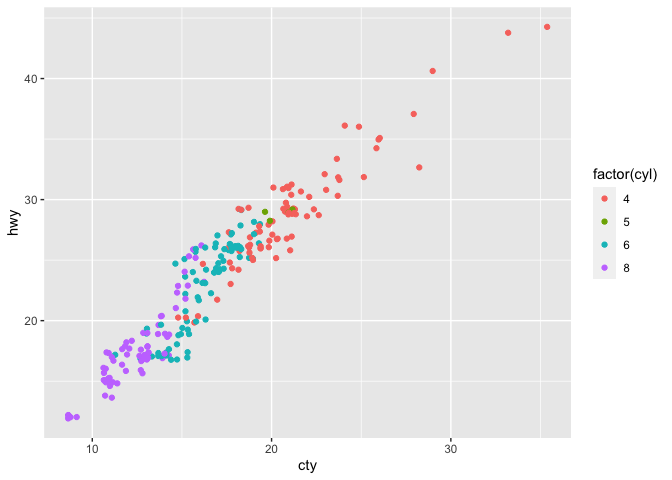<!-- -->

But we want cleaner and more effective plot for sharing.

Let’s add:

-   clearer axes
-   axes legends
-   plot title
-   bolder colors

``` r
ggplot(mpg, aes(cty, hwy, color = factor(cyl))) +
  geom_jitter() + 
  labs(x = "City mileage/gallon",
    y = "Highway mileage/gallon",
    colour = "Cylinders",
    title = "Highway and city mileage are highly correlated") +
  scale_colour_brewer(type = "seq", palette = "Spectral")
```

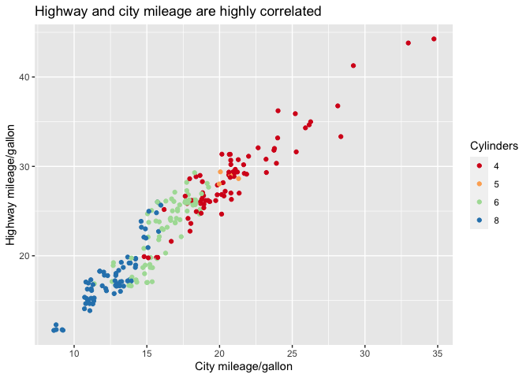<!-- -->

But we need more:

-   white background
-   legend inside plotting layout
-   major gridelines gray
-   no minor gridlines
-   plot title boldface size 12

``` r
ggplot(mpg, aes(cty, hwy, color = factor(cyl))) +
  geom_jitter() + 
  labs(x = "City mileage/gallon",
    y = "Highway mileage/gallon",
    colour = "Cylinders",
    title = "Highway and city mileage are highly correlated") +
  scale_colour_brewer(type = "seq", palette = "Spectral") +
  theme_bw() + 
  theme(
    plot.title = element_text(face = "bold", size = 12),
    legend.background = element_rect(fill = "white", size = 4, colour = "white"),
    legend.justification = c(0, 1),
    legend.position = c(0, 1),
    axis.ticks = element_line(colour = "grey70", size = 0.2),
    panel.grid.major = element_line(colour = "grey70", size = 0.2),
    panel.grid.minor = element_blank()
  )
```

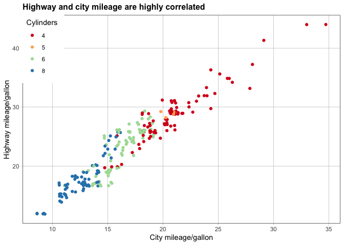<!-- -->

Personally, I prefer no gridlines and large font sizes for labels.

``` r
ggplot(mpg, aes(cty, hwy, color = factor(cyl))) +
  geom_jitter() + 
  labs(x = "City mileage/gallon",
    y = "Highway mileage/gallon",
    colour = "Cylinders",
    title = "Highway and city mileage are highly correlated") +
  scale_colour_brewer(type = "seq", palette = "Spectral") +
  theme_bw() + 
  theme(
    plot.title = element_text(face = "bold", size = 12),
    legend.background = element_rect(fill = "white", size = 4, colour = "white"),
    legend.justification = c(0, 1),
    legend.position = "top",
    axis.ticks = element_line(colour = "grey70", size = 0.2),
    axis.title.x = element_text(size = 15),
    axis.title.y = element_text(size = 15),
    axis.text.x = element_text(size = 15),
    axis.text.y = element_text(size = 15),
    panel.grid.major = element_blank(),
    panel.grid.minor = element_blank()
  )
```

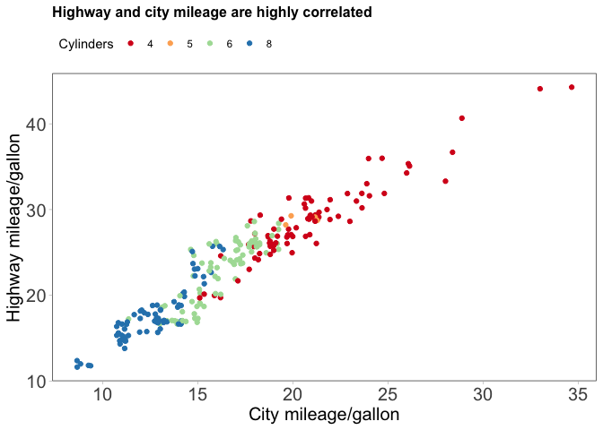<!-- -->

As you can see, this is highly effective and offers pinpoint control.
(See `?theme` for the extensive list of arguments!) However, complete
themes may be a good option as your thematic modifications increase and
a complete theme offers a lot of what you need.

### Complete themes

Complete themes are theme commands that apply a coherent set of theme
element modifications at the same time.

There are eight complete themes built in to `ggplot2`, although numerous
other packages offer complete themes.

The `ggplot2` complete themes include:

``` r
library(patchwork)
df <- data.frame(x = 1:3, y = 1:3)
base <- ggplot(df, aes(x, y)) + geom_point()
t1 <- base + theme_grey() + ggtitle("theme_grey()")
t2 <- base + theme_bw() + ggtitle("theme_bw()")
t3 <- base + theme_linedraw() + ggtitle("theme_linedraw()")
t4 <- base + theme_light() + ggtitle("theme_light()")
t5 <- base + theme_dark() + ggtitle("theme_dark()")
t6 <- base + theme_minimal()  + ggtitle("theme_minimal()")
t7 <- base + theme_classic() + ggtitle("theme_classic()")
t8 <- base + theme_void() + ggtitle("theme_void()")

(t1 | t2 | t3 ) / (t4 | t5 | t6 ) / (t7 | t8 | plot_spacer())
```

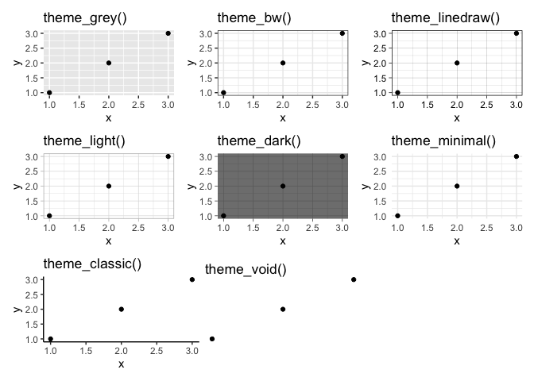<!-- -->

Personally, my go-to is `theme_classic()` because is has the fewest
added visual elements, which I think helps improve clarity. Let’s
revisit the above plot that extensively manipulated the theme elements,
but now try with a complete theme.

``` r
ggplot(mpg, aes(cty, hwy, color = factor(cyl))) +
  geom_jitter() + 
  labs(x = "City mileage/gallon",
    y = "Highway mileage/gallon",
    colour = "Cylinders",
    title = "Highway and city mileage are highly correlated") +
  scale_colour_brewer(type = "seq", palette = "Spectral") +
  theme_classic(base_size = 15)
```

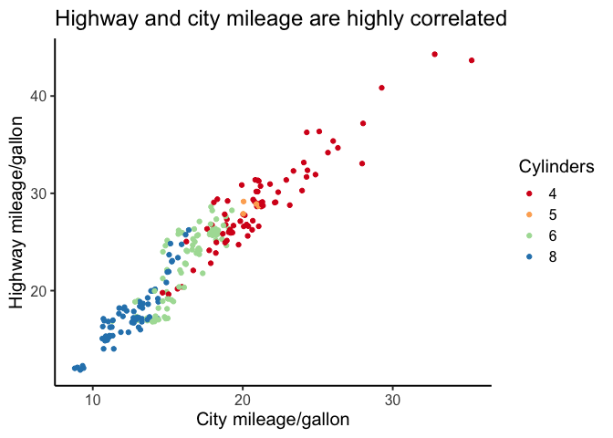<!-- -->

A number of other packages have complete themes that may be of interest.
Some of the themes get specific, but they can be useful to know about.
Let’s look at a few.

\#\#\#\#`library(ggthemes)`

``` r
library(ggthemes)
base + theme_tufte() + ggtitle("theme_tufte()")
```

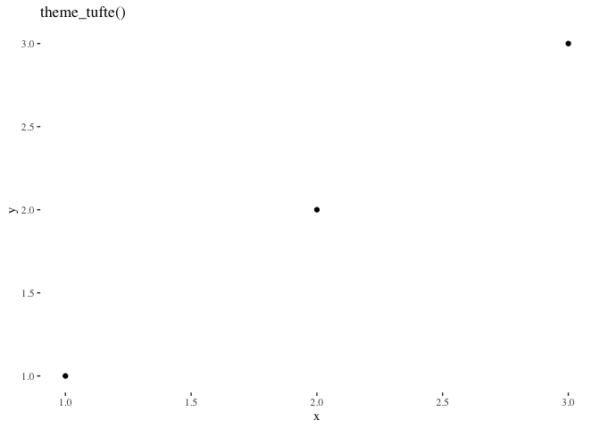<!-- -->

``` r
base + theme_solarized() + ggtitle("theme_solarized()")
```

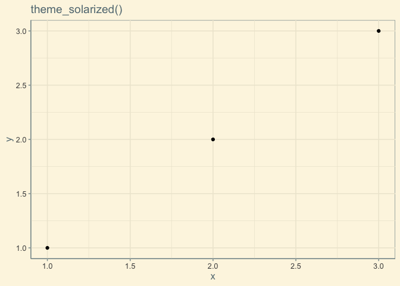<!-- -->

``` r
base + theme_excel() + ggtitle("theme_excel()")
```

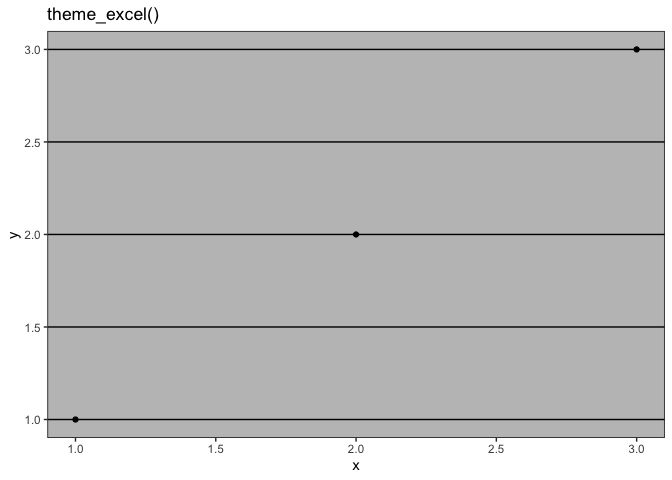<!-- -->

Maybe you like the `theme_solarized()` but want larger font sizes. You
cannot mix complete themes and would need to work within the favored
complete theme for further modifications.

Does not work:

``` r
base + theme_solarized() + 
  ggtitle("theme_solarized()") +
  theme_classic(base_size = 15)
```

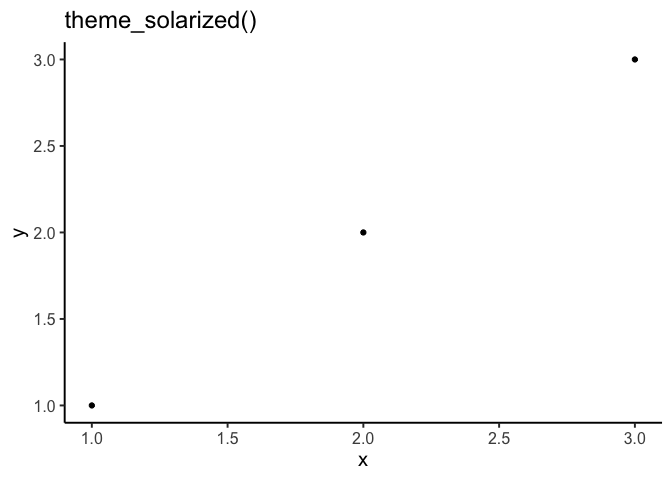<!-- -->

Does work:

``` r
base + theme_solarized(base_size = 15) + 
  ggtitle("theme_solarized()") 
```

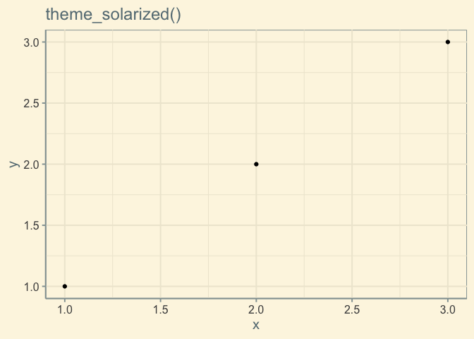<!-- -->

#### Other libraries

There are several other libraries devoted to complete themes; however,
several did not work with my version of R and/or required additional
downloading of fonts, etc. Please explore any of them and report back if
you find them useful. You are welcome to check out `hrbrthemes`,
`ggthemr`,`ggtech`,`ggpomological`, among others.

### Assignment 1: Part 2

Everyone did well on Assignment 1; however, there were some common
issues that I wanted to review and correct.

1.  Please submit assignments before the deadline.
2.  Submit 1 document (typically HTML or Word)
3.  Include your last name in the file name

If you would like to earn back half of your points lost, there is a
one-time option to do so.

-   Select one of your plots from Assignment 1
-   Revise based on any comments provided
-   Include a complete theme or modify multiple thematic elements
-   Prepare a “publication ready” version of this figure in which all
    labels are correct and readable, the best geom is used, and other
    figure and thematic elements are maximally effective.
