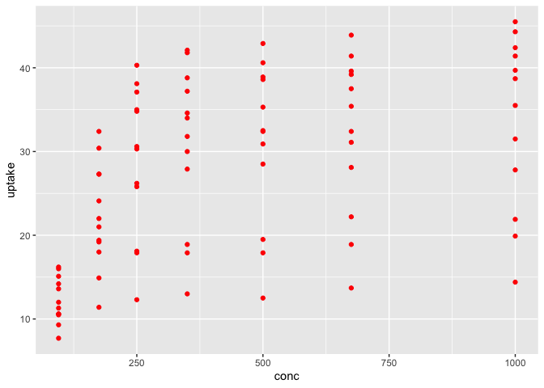

ggplot2: Colors
================
ggSeminar
Fall 2021

## Colors

Color can be one of the most powerful elements of your `ggplot` because
of the intrinsic attraction and meaning that humans have with color
coupled with the information that color can map to your visual.

Most color used in figures can be applied in one of three ways.

#### 1. Qualitative

-   Typically a smaller number of discrete hues (colors) that are not
    intended to be related to each other but to represent qualitative or
    categorical differences
-   Example could be barplot of cars sold by color, where car color
    matches bar color

#### 2. Sequential

-   A small to large numbers of colors that typically are a single hue
    varying in intensity by decreasing tint (adding white) or increasing
    shades (adding black)
-   Sequential colors can also include the transition from one hue to
    another
-   Example is a map of COVID-19 cases where fewer cases are represented
    by lighter colors and greater numbers of cases are represented by
    darker colors

#### 3. Diverging

-   Comparable to sequential colors, a diverging color scheme typically
    includes a clear middle hue (white) from which two sequential color
    schemes move in opposite directions
-   Example is political maps where white (or purple) indicates evenness
    in two-party election and increasing shades of red or blue indicate
    greater proportion of each political party

<div class="figure">


<p class="caption">
Common color schemes
</p>

</div>

### How color is mapped in `ggplot`

Recall from an earlier lesson that color can be mapped as an aesthetic
or simply specified for inclusion without representing variable
information. When color is specified outside the aesthetic, it does not
represent information.

``` r
library(tidyverse)
ggplot(data = CO2) +
    geom_point(mapping = aes(x = conc, y = uptake), 
               color = "red") # outside the aesthetic, aes()
```

<!-- -->

When color is specified as an aesthetic it must be mapped to a variable,
which it will then represent.

``` r
ggplot(data = CO2) +
    geom_point(mapping = aes(x = conc, y = uptake, color = Plant)) 
```

<!-- -->

Let’s assume most of the time we use color we want it to represent
something. This is a very powerful use of color, but as you can see from
the above example, simply specifying `Plant` did not allow us to control
the color we may have wanted.

In order to manipulate colors that are mapped as aesthetics, we need to
add a `scale` to our `ggplot`.

*Scales* in `ggplot2` control the mapping from data to aesthetics and
are not unique for color, but color scales are one of the more common
uses of scales.

An excellent overview, with examples, of `scales` can be found
[here](https://ggplot2tor.com/scales/). Let’s try a few.

Below is a simple plot of miles per gallon (`mpg`) as a function of
horsepower (`hp`). Color is added to add information about the number of
cylinders (`cyl`).

``` r
ggplot(data = mtcars) +
  geom_point(mapping = aes(x = hp, y = mpg, color = cyl),
             size = 2) +
  theme_classic(base_size = 15)
```

<!-- -->

Cylinders is probably best visualized as a sequential variable, but
let’s say we want to give each level of cylinders its own qualitative
color. For this we can use the `scale_color_discrete()` command.

``` r
ggplot(data = mtcars) +
  geom_point(mapping = aes(x = hp, y = mpg, color = cyl),
             size = 2) +
  scale_color_discrete() +
  theme_classic(base_size = 15)
```

The above code doesn’t work because `cyl` is not a discrete variable
(e.g., ). But an `as.factor()` wrapper will change that variable type to
be able to be read as a discrete variable.

``` r
ggplot(data = mtcars) +
  geom_point(mapping = aes(x = hp, y = mpg, color = as.factor(cyl)),
             size = 2) +
  scale_color_discrete() +
  theme_classic(base_size = 15)
```

<!-- -->

Maybe we want some different colors. The default `ggplot2` colors are
nice, but not always what we want or need. It can be very useful to know
how to hard code your own colors. `scale_color_manual()` allows for
manual color specification.

``` r
ggplot(data = mtcars) +
  geom_point(mapping = aes(x = hp, y = mpg, color = as.factor(cyl)),
             size = 2) +
  scale_color_manual(values = c('#584DB8', '#38573B', '#F58B7F')) +
  theme_classic(base_size = 15)
```

<!-- -->

But a lot of popular color packages also make color palettes very
accessible. The `RColorBrewer` package is worth having handy for its
ready-made color palettes.

``` r
library(RColorBrewer)
par(mar=c(3,4,2,2))
display.brewer.all()
```

<!-- -->

And several are color-blind friendly.

``` r
display.brewer.all(colorblindFriendly = TRUE)
```

<!-- -->

Maybe we like `Dark2` for a qualitative palette. `scale_color_brewer()`
should do the trick.

``` r
ggplot(data = mtcars) +
  geom_point(mapping = aes(x = hp, y = mpg, color = as.factor(cyl)),
             size = 2) +
  scale_color_brewer(palette = 'Dark2') +
  theme_classic(base_size = 15)
```

<!-- -->

Let’s try a geometry with color and fill. The `InsectSprays` data set
has data for 6 different sprays, which may be related, but may be
qualitative. Also, let’s check out the `viridis` color package for this.
`Viridis` includes a few multi-sequential color maps that can be used in
a sequential form or from which colors can be selected.

``` r
library(viridis)
ggplot(data = InsectSprays) +
  geom_violin(mapping = aes(x = spray, y = count, color = spray, fill = spray),
             size = 2) +
  scale_fill_viridis_d(alpha = 0.4, option = "C") + #"C" for plasma
  scale_color_viridis_d(option = "C") +
  theme_classic(base_size = 15)
```

<!-- -->

Maybe we just want part of the plasma color map.

``` r
ggplot(data = InsectSprays) +
  geom_violin(mapping = aes(x = spray, y = count, color = spray, fill = spray),
             size = 2) +
  scale_fill_viridis_d(alpha = 0.4, option = "C", begin = 0, end = 0.5) + #"C" for plasma
  scale_color_viridis_d(option = "C", begin = 0, end = 0.5) +
  theme_classic(base_size = 15)
```

<!-- -->

And finally, there are a lot of great color packages out there with
everything from full-customizable color palettes to very prescribed
color sets. `ggsci` is a package that uses color palettes based on
common scientific journals and science fiction themes.

``` r
library(ggsci)
ggplot(data = InsectSprays) +
  geom_boxplot(mapping = aes(x = spray, y = count, color = spray, fill = spray),
             size = 2) +
  scale_color_jama() + # JAMA = Journal of the American Medical Association
  scale_fill_jama(alpha = 0.4) +
  theme_classic(base_size = 15)
```

<!-- -->

``` r
ggplot(data = InsectSprays) +
  geom_boxplot(mapping = aes(x = spray, y = count, fill = spray),
             size = 1.5, color = "darkgray") +
  scale_fill_startrek(alpha = 0.8) + # Star Trek
  theme_classic(base_size = 15)
```

<!-- -->

The following table has links to some good and useful color packages.

| Package Name      | Description                                                                                       |
|-------------------|---------------------------------------------------------------------------------------------------|
| `viridis`         | [Viridis Colors](https://cran.r-project.org/web/packages/viridis/vignettes/intro-to-viridis.html) |
| `RColorBrewer`    | [Color Brewer 2](https://colorbrewer2.org/#type=sequential&scheme=BuGn&n=3)                       |
| `ggsci`           | [Science and Sci-Fi](https://cran.r-project.org/web/packages/ggsci/vignettes/ggsci.html)          |
| `ggthemes`        | [Themed Colors](https://github.com/beanumber/teamcolors)                                          |
| `NineteenEightyR` | [1980s colors](https://github.com/m-clark/NineteenEightyR/)                                       |
| `LaCroixColoR`    | [LaCroix Water](https://github.com/johannesbjork/LaCroixColoR)                                    |
| `teamcolors`      | [Pro Sports Teams](https://github.com/beanumber/teamcolors)                                       |

**This [link](https://github.com/EmilHvitfeldt/r-color-palettes) will
waste your time!**

### Assignment 2

For assignment 2, you need to make 3 figures.

1.  Find an R dataset(s) or use your own data such that each of the
    three figures demonstrates a correct use of each of the three color
    schemes. Use `ggtitle()` to give each figure a title based on the
    color

2.  Use a different `geom()` for each of the three figures, which should
    be easy because you will need to plot different types of data.

3.  Consider themes, axes, labels, or anything else you can do to make
    your figures publication ready and professional looking.

4.  Submit the the 3 figures in one file via email by 9am Friday,
    October 8
