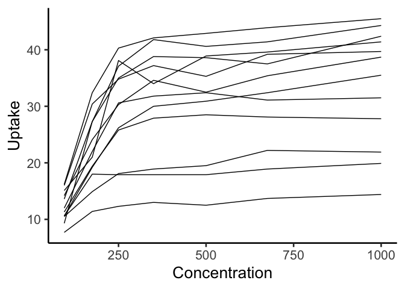
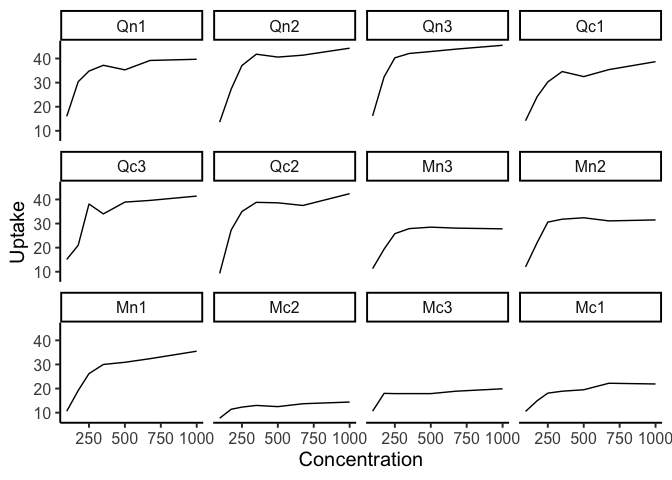
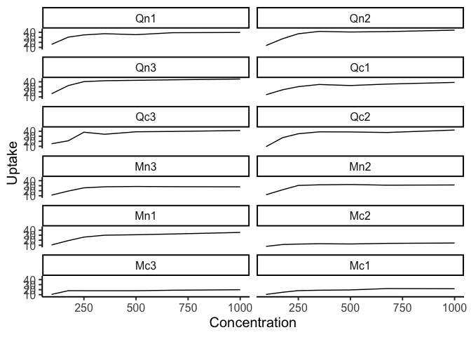
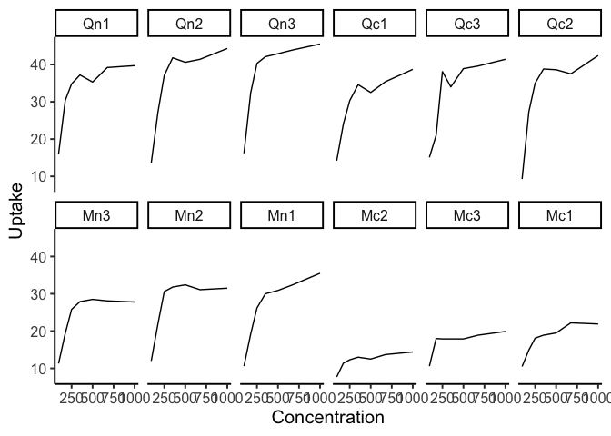
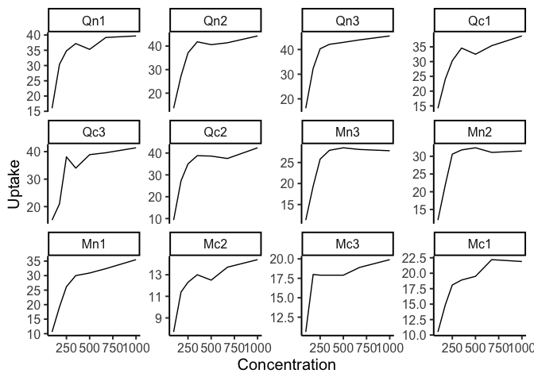
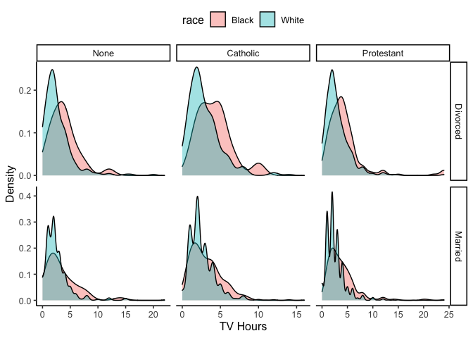
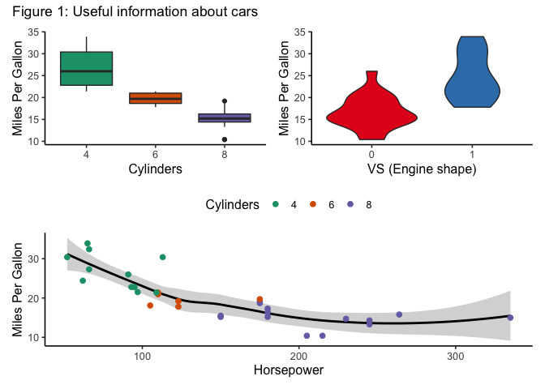
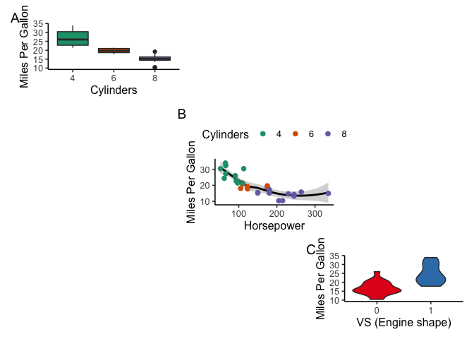

ggplot2: Layouts
================
ggSeminar
Fall 2021

## Layouts

Commanding layouts may not be a fundamental data visualization skill,
but it can greatly improve your toolbox when it comes combining
important figures in compelling ways. Minimally, you may just need to
create small multiples of a figure for visualization purposes or you may
need to combine figures to reduce the total number of figures. However,
you may also come to see different figure combinations and
juxtapositions as an effective way to tell your story.

**Panel**: One component of a figure; may be a miniature figure

**Figure**: The overall figure, often just one panel or many combined
panels

#### Small Multiples

Small multiples are a great way to split out groups from a larger plot,
in which you can retain and enhance the visual message because you have
reduced the congestion in the figure.

``` r
library(tidyverse)
ggplot(data = CO2) +
  geom_line(mapping = aes(x = conc, y = uptake, color = Plant)) +
  scale_color_manual(values = rep("black",12)) +
  xlab("Concentration") +
  ylab("Uptake") +
  theme_classic(base_size = 20) +
  theme(legend.position = "none")
```

<!-- -->

The `facet_wrap()` function in `ggplot2` is a great way to make small
multiples while still operating within the confines of your plot.

``` r
ggplot(data = CO2) +
  geom_line(mapping = aes(x = conc, y = uptake)) +
  theme_classic(base_size = 15) +
  xlab("Concentration") +
  ylab("Uptake") +
  theme(legend.position = "none") +
  facet_wrap(~Plant)
```

<!-- -->

You can easily modify the columns and rows.

``` r
ggplot(data = CO2) +
  geom_line(mapping = aes(x = conc, y = uptake)) +
  theme_classic(base_size = 15) +
  xlab("Concentration") +
  ylab("Uptake") +
  theme(legend.position = "none") +
  facet_wrap(~Plant, ncol = 2)
```

<!-- -->

``` r
ggplot(data = CO2) +
  geom_line(mapping = aes(x = conc, y = uptake)) +
  theme_classic(base_size = 15) +
  xlab("Concentration") +
  ylab("Uptake") +
  theme(legend.position = "none") +
  facet_wrap(~Plant, nrow = 2)
```

<!-- -->

Another issue that comes up with faceted panels is whether to retain
common axes ranges. The general advice is to keep all axes the same
because interpretation can be difficult once the variable space changes
for each panel. But sometimes you will want to change an axis.

``` r
ggplot(data = CO2) +
  geom_line(mapping = aes(x = conc, y = uptake)) +
  theme_classic(base_size = 15) +
  xlab("Concentration") +
  ylab("Uptake") +
  theme(legend.position = "none") +
  facet_wrap(~Plant, scales = "free_y")
```

<!-- -->

Note that these panels all have the same *x*-axis range, so
`scales = "free_x"` would not do much of anything.

Let’s try another data set with two types of groups and more
information.

`facet_grid()` is another function for paneling and can facet by two
factors of interest. Here, let’s subset the general social survey
dataset to some well-populated\* factors and then use a `fact_grid`.

\*You will find that for many data sets that have low-sample size
groups, faceting may produce warnings or have groups that don’t plot
well. This all needs to be addressed on an as-needed basis.

``` r
library(RColorBrewer)
gss_cat %>% filter(marital %in% c("Never Married", "Divorced", "Married") &
                     relig %in% c("None","Catholic", "Protestant") &
                     race %in% c("Black", "White")) %>%
ggplot() +
  geom_density(mapping = aes(x = tvhours, fill = race), alpha = 0.4) +
  scale_color_brewer(palette = "Dark2") +
  xlab("TV Hours") +
  ylab("Density") +
  theme_classic(base_size = 12) +
  theme(legend.position = "top") +
  facet_grid(~marital ~ relig, scales = "free")
```

<!-- -->

#### `patchwork`

There are a few packages that allow for paneling or manipulation of
layouts. I prefer [`patchwork`](https://patchwork.data-imaginist.com/)
for it’s ease of use, but you may like others. In the interest of time
we will only cover `patchwork`, but I think you will find it does a lot
of what you need.

Patchwork is designed to plot saved `ggplot2` objects, so it is best to
get into the habit of assigning names to your plots.

Let’s use the `mtcars` dataset to make some figures.

``` r
library(patchwork)
p1 <- ggplot(mtcars) +
  geom_boxplot(mapping = aes(x = as.factor(cyl), y = mpg, fill = as.factor(cyl))) +
  scale_fill_brewer(palette = "Dark2") +
  xlab("Cylinders") +
  ylab("Miles Per Gallon") +
  theme_classic(base_size = 12) +
  theme(legend.position = "none") 

p2 <- ggplot(mtcars) +
  geom_smooth(aes(x = hp, y = mpg), formula = 'y ~ x', color = "black") +
  geom_point(mapping = aes(x = hp, y = mpg, color = as.factor(cyl)), size = 2) +
  scale_color_brewer(palette = "Dark2") +
  xlab("Horsepower") +
  ylab("Miles Per Gallon") +
  labs(color = "Cylinders") +
  theme_classic(base_size = 12) +
  theme(legend.position = "top") 

p3 <- ggplot(mtcars) +
  geom_violin(mapping = aes(x = as.factor(vs), y = mpg, fill = as.factor(vs))) +
  scale_fill_brewer(palette = "Set1") +
  xlab("VS (Engine shape)") +
  ylab("Miles Per Gallon") +
  theme_classic(base_size = 12) +
  theme(legend.position = "none") 

((p1 | p3) / p2) + 
  plot_annotation(title = 'Figure 1: Useful information about cars')
```

<!-- -->

Other elements can be incorporated.

``` r
(p1 | plot_spacer() | plot_spacer()) / 
  (plot_spacer() | p2  | plot_spacer()) / 
  (plot_spacer() | plot_spacer() | p3) + 
  plot_annotation(tag_levels = 'A')
```

<!-- -->
