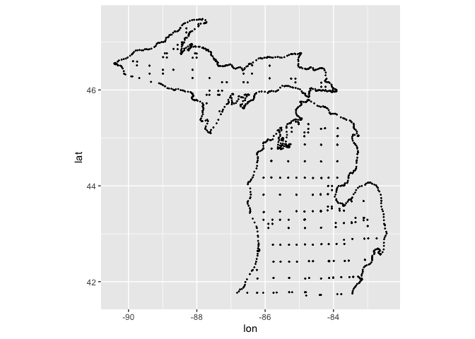
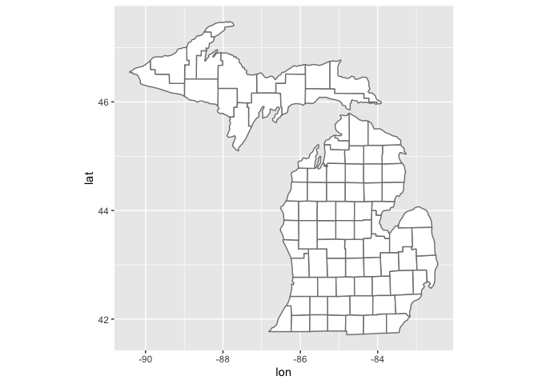
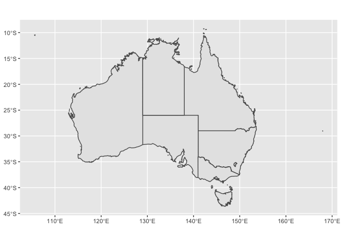
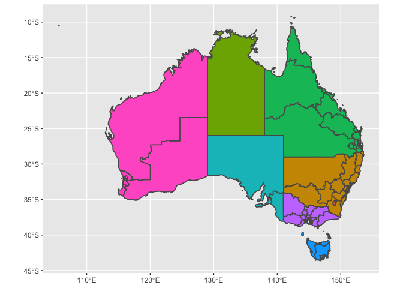
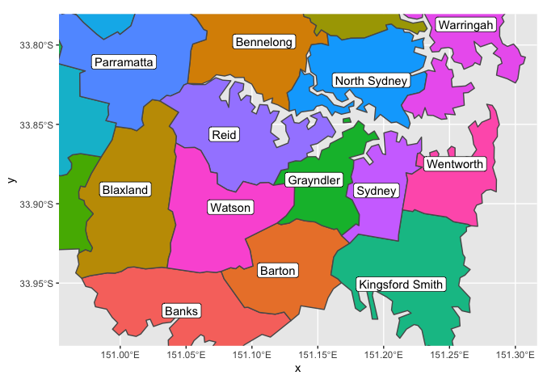
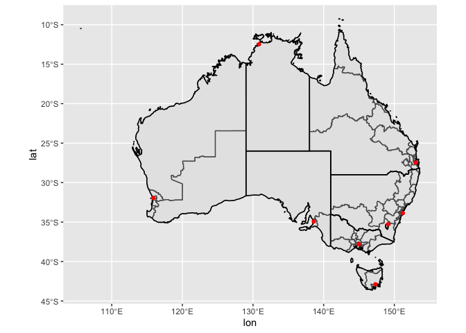
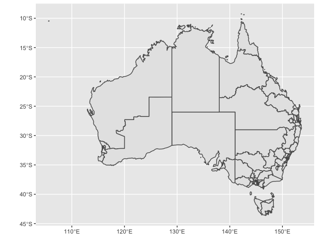
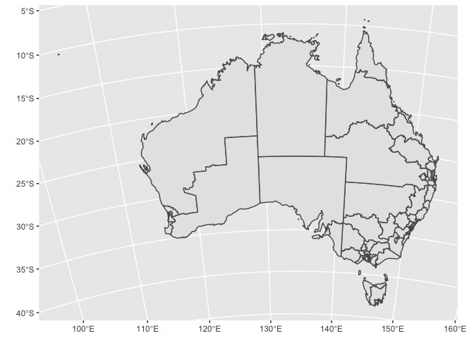
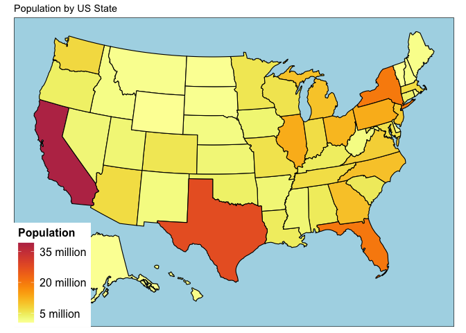
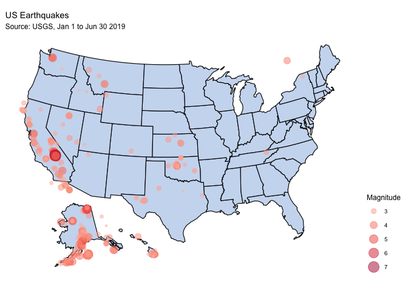

ggplot2: Maps
================
ggSeminar
Fall 2021

## Maps

This mapping lesson will be limited. First, because this course is all
about `ggplot2`, we are limiting ourselves to only the basics of maps
that can be made using `ggplot2`. There is a huge amount we are missing
when it comes to making maps in R. Second, we are only skimming the
surface of making maps for visual purposes. That is, maps and mapping
can be an entire field of spatial analyses, and unfortunately we don’t
have the time to get into the analytic aspects of spatial data other
than making simple maps as you might need for a study or report.

This lesson draws directly and heavily from [Chapter
6](https://ggplot2-book.org/maps.html) in the `ggplot2` text.

Keep in mind: A central challenge to most maps is that they draw from
two sources: your data that you want to map and some reference data that
helps create the map.

#### Simple polygon maps

`geom_polygon()` will build very simple maps from boundaries (polygons).
Let’s look at some county boundaries for Michigan.

``` r
library(tidyverse)
mi_counties <- map_data("county", "michigan") %>% 
  select(lon = long, lat, group, id = subregion)
head(mi_counties)
```

    ##         lon      lat group     id
    ## 1 -83.88675 44.85686     1 alcona
    ## 2 -83.36536 44.86832     1 alcona
    ## 3 -83.36536 44.86832     1 alcona
    ## 4 -83.33098 44.83968     1 alcona
    ## 5 -83.30806 44.80530     1 alcona
    ## 6 -83.30233 44.77665     1 alcona

We could just try to plot this data as points.

``` r
ggplot(mi_counties, aes(lon, lat)) + 
  geom_point(size = .25, show.legend = FALSE) +
  coord_quickmap()
```

<!-- -->

We can tell it is Michigan, but not really what the points mean. If we
try plotting as a polygon instead, we get what we are looking for.

``` r
ggplot(mi_counties, aes(lon, lat, group = group)) +
  geom_polygon(fill = "white", colour = "grey50") + 
  coord_quickmap()
```

<!-- -->

But most maps we need will require more complexity, and we can’t always
use latitude and longitude as easily as we did in this example (because
spatial data takes on many different coordinates and systems).

#### `sf` package

Vector data for maps are typically encoded using the standards produced
by the Open Geospatial Consortium. The [sf
package](https://github.com/r-spatial/sf) developed by Edzer Pebesma
provides an excellent toolset for working with such data, and the
`geom_sf()` and `coord_sf()` functions in `ggplot2` are designed to work
together with the sf package.

Let’s look at an example mapping data from Australia.

``` r
library(ozmaps)
library(sf)

oz_states <- ozmaps::ozmap_states
oz_states
```

    ## Simple feature collection with 9 features and 1 field
    ## Geometry type: MULTIPOLYGON
    ## Dimension:     XY
    ## Bounding box:  xmin: 105.5507 ymin: -43.63203 xmax: 167.9969 ymax: -9.229287
    ## Geodetic CRS:  GDA94
    ## # A tibble: 9 × 2
    ##   NAME                                                                  geometry
    ## * <chr>                                                       <MULTIPOLYGON [°]>
    ## 1 New South Wales              (((150.7016 -35.12286, 150.6611 -35.11782, 150.6…
    ## 2 Victoria                     (((146.6196 -38.70196, 146.6721 -38.70259, 146.6…
    ## 3 Queensland                   (((148.8473 -20.3457, 148.8722 -20.37575, 148.85…
    ## 4 South Australia              (((137.3481 -34.48242, 137.3749 -34.46885, 137.3…
    ## 5 Western Australia            (((126.3868 -14.01168, 126.3625 -13.98264, 126.3…
    ## 6 Tasmania                     (((147.8397 -40.29844, 147.8902 -40.30258, 147.8…
    ## 7 Northern Territory           (((136.3669 -13.84237, 136.3339 -13.83922, 136.3…
    ## 8 Australian Capital Territory (((149.2317 -35.222, 149.2346 -35.24047, 149.271…
    ## 9 Other Territories            (((167.9333 -29.05421, 167.9188 -29.0344, 167.93…

This provides a nice summary of the data, and we might notice that
`Geometry type: MULTIPOLYGON`. This means we need to use `geom_sf()` and
`coord_sf()`, both of which are functions that will understand this data
type.

``` r
ggplot(oz_states) + 
  geom_sf() + 
  coord_sf() # for the map projection
```

<!-- -->

Next, we may want to add more information, which can be done as most
things are done in `ggplot2`: by adding layers.

Let’s try to add the `oz_states` information, but first we need to
remove some things we don’t want mapped and simplify the boundaries
(which might otherwise take a long time to render).

``` r
library(rmapshaper)
oz_states <- ozmaps::ozmap_states %>% filter(NAME != "Other Territories")
oz_votes <- rmapshaper::ms_simplify(ozmaps::abs_ced)
```

And give the map a try.

``` r
ggplot() + 
  geom_sf(data = oz_states, mapping = aes(fill = NAME), show.legend = FALSE) +
  geom_sf(data = oz_votes, fill = NA) + 
  coord_sf()
```

<!-- -->

Another feature you may want or need for your maps is labelling. Let’s
see an example of labeling the map we have been working with.

``` r
# filter electorates in the Sydney metropolitan region
sydney_map <- ozmaps::abs_ced %>% filter(NAME %in% c(
  "Sydney", "Wentworth", "Warringah", "Kingsford Smith", "Grayndler", "Lowe", 
  "North Sydney", "Barton", "Bradfield", "Banks", "Blaxland", "Reid", 
  "Watson", "Fowler", "Werriwa", "Prospect", "Parramatta", "Bennelong", 
  "Mackellar", "Greenway", "Mitchell", "Chifley", "McMahon"
))

# draw the electoral map of Sydney
ggplot(sydney_map) + 
  geom_sf(aes(fill = NAME), show.legend = FALSE) + 
  coord_sf(xlim = c(150.97, 151.3), ylim = c(-33.98, -33.79)) + 
  geom_sf_label(aes(label = NAME), label.padding = unit(1, "mm"))
```

    ## Warning in st_point_on_surface.sfc(sf::st_zm(x)): st_point_on_surface may not
    ## give correct results for longitude/latitude data

<!-- -->

Let’s try this polygon with some points. In this case, we can just use
`geom_point()` to add x-y coordinates of capitals.

``` r
oz_capitals <- tibble::tribble( 
  ~city,           ~lat,     ~lon,
  "Sydney",    -33.8688, 151.2093,  
  "Melbourne", -37.8136, 144.9631, 
  "Brisbane",  -27.4698, 153.0251, 
  "Adelaide",  -34.9285, 138.6007, 
  "Perth",     -31.9505, 115.8605, 
  "Hobart",    -42.8821, 147.3272, 
  "Canberra",  -35.2809, 149.1300, 
  "Darwin",    -12.4634, 130.8456, 
)

ggplot() + 
  geom_sf(data = oz_votes) + 
  geom_sf(data = oz_states, colour = "black", fill = NA) + 
  geom_point(data = oz_capitals, mapping = aes(x = lon, y = lat), colour = "red") + 
  coord_sf()
```

<!-- -->

Problems with the above maps arise when accuracy becomes important. (To
be clear, the above maps are great for representation, so there is
nothing inherently wrong with them.) The earth is not flat, nor is it
perfectly spherical, and combined with several other referencing issues
the bottom line is that we need to pick a geodetic datum as a reference.
You may have heard of common datums like the North American Datum
(NAD83; good for North America) or the World Geodetic System (WGS84) if
you perspective is global. We also need to consider the distortion that
will take place when any map (and associated datum) is projected from
the 3-dimensional globe to a 2-dimensional figure. Map projections are
the different choices you have when considering this projection
distortion. (Map projections tend to be area-preserving and
shape-preserving, and you’ll need to pick one based on your priorities.)

In summary:

Geodetic datum (e.g, WGS84) + map projection (e.g., Mercator) +
parameters of the projection (e.g., location of the origin) = coordinate
reference system, or CRS

An sf object often includes a default CRS (run `st_crs(oz_votes)` to
see).

In `ggplot2`, the CRS is controlled by `coord_sf()`, which ensures that
every layer in the plot uses the same projection.

By default, `coord_sf()` uses the CRS associated with the geometry
column of the data, but you may want to be familiar with how to query
and manipulate CRS; you can specify the `crs` parameter by passing valid
user input to `st_crs()`.

``` r
ggplot(oz_votes) + geom_sf()
```

<!-- -->

``` r
ggplot(oz_votes) + geom_sf() + coord_sf(crs = st_crs(3112))
```

<!-- -->

### Other simple examples

The package
[`usmap`](https://cran.r-project.org/web/packages/usmap/usmap.pdf) ia a
good and simple package for plotting things in the US (which is often
the case). Below are a few simple examples just to show you how easily
some maps can be made and how the `ggplot2` syntax is used.

Example 1. Create a map of states filled by population.

``` r
library(usmap)
library(viridis)

plot_usmap(data = statepop, values = "pop_2015") + 
  labs(title = "", fill = "Population") + 
  scale_fill_viridis(begin = 0.5, end = 1, direction = -1, option = "B",
                     breaks = c(5000000,20000000,35000000),
                     labels = c("5 million", "20 million", "35 million")) +
  theme(panel.background = element_rect(color = "black", fill = "lightblue"),
        legend.title = element_text(size=12,face="bold"),
        legend.text = element_text(size=12)) +
  ggtitle("Population by US State")
```

<!-- -->

Example 2: Plotting earthquakes based on coordinates.

``` r
library(ggthemes)
# Transform to usmaps projection (Albers Equal Area projection)
eq_transformed <- usmap_transform(earthquakes)
```

    ## Warning in showSRID(uprojargs, format = "PROJ", multiline = "NO", prefer_proj =
    ## prefer_proj): Discarded datum unknown in Proj4 definition

    ## Warning in sp::proj4string(transformed): CRS object has comment, which is lost
    ## in output

    ## Warning in showSRID(uprojargs, format = "PROJ", multiline = "NO", prefer_proj
    ## = prefer_proj): Discarded datum Unknown based on Normal Sphere (r=6370997)
    ## ellipsoid in Proj4 definition

    ## Warning in sp::proj4string(transformed): CRS object has comment, which is lost
    ## in output

    ## Warning in showSRID(uprojargs, format = "PROJ", multiline = "NO", prefer_proj
    ## = prefer_proj): Discarded datum Unknown based on Normal Sphere (r=6370997)
    ## ellipsoid in Proj4 definition

``` r
plot_usmap(fill = "#CCDBF0") +
  geom_point(data = eq_transformed, 
             aes(x = lon.1, y = lat.1, size = mag, color = mag),
             alpha = 0.5) +
  scale_colour_gradient_tableau(palette = "Red", guide = "legend") +
  labs(title = "US Earthquakes",
       subtitle = "Source: USGS, Jan 1 to Jun 30 2019",
       size = "Magnitude",
       color = "Magnitude") +
  theme(legend.position = "right")
```

<!-- -->
