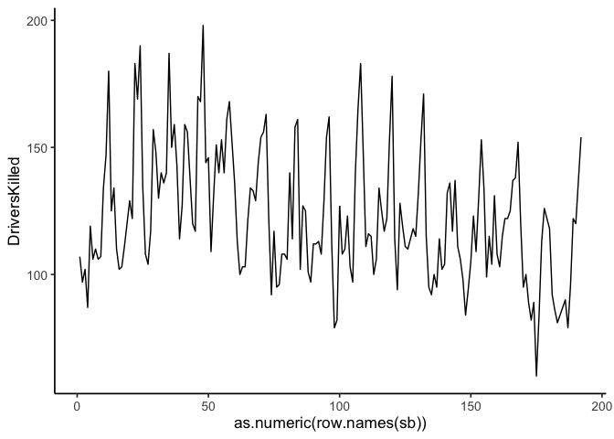
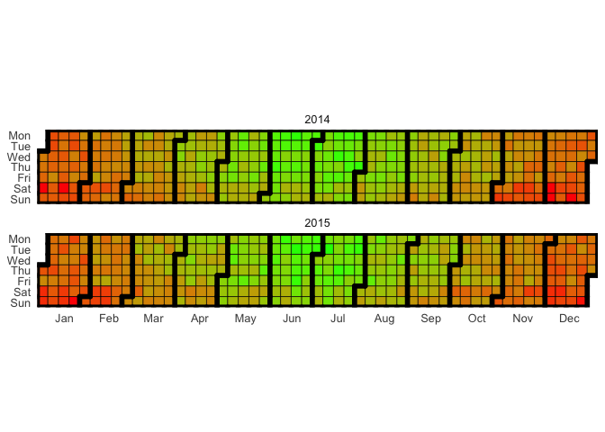
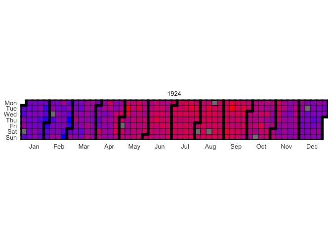
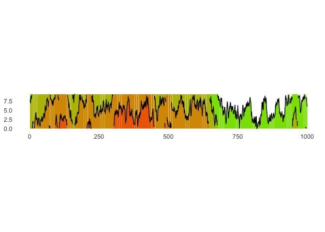
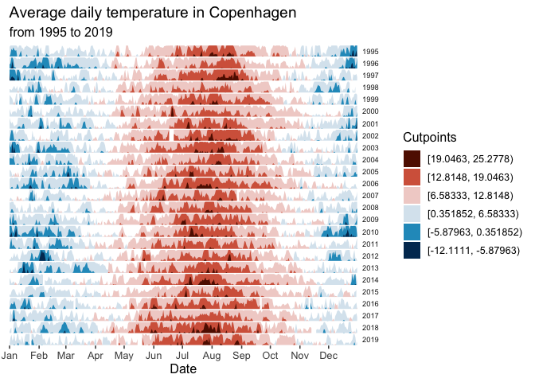
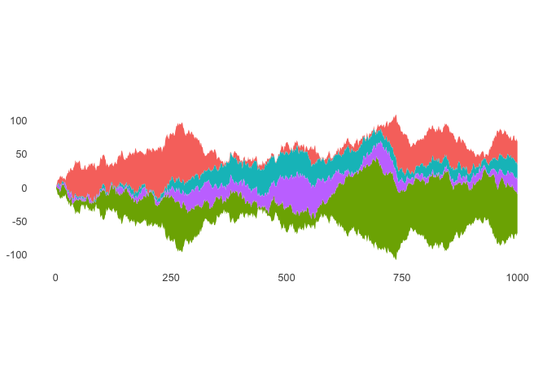
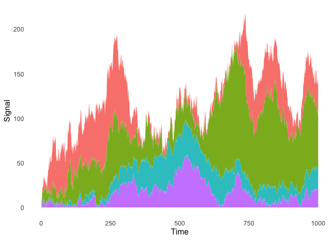
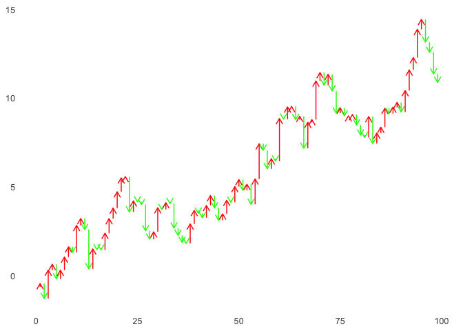

ggplot2: Time Series
================
ggSeminar
Fall 2021

## Time Series

In a way, time series are not all that different from plotting other
data types. If any measure of time occurs along the *x*-axis, it can be
called time series. This lesson will not instruct you on how to analyze
time series data, but will provide you with some approaches to
displaying time series data, drawn primarily from the `ggtimeseries`
package and tutorial.

First, install `ggtimeseries` and some other libraries we will need

``` r
devtools::install_github('Ather-Energy/ggTimeSeries')
library(ggTimeSeries)
library(tidyverse)
library(data.table)
```

`ggtimeseries` reviews several geoms that provide alternatives to
`geom_line()`, which is a trusted geom for visualizing time series but
perhaps not always the only tool you want.

But first, let’s look at a simple example of `geom_line()`.

``` r
sb <- as.data.frame(Seatbelts)
ggplot(sb) +
   geom_line(aes(x = as.numeric(row.names(sb)), y = DriversKilled)) +
   theme_classic(base_size = 13)
```

<!-- -->

Here, we just used the row order for the x-variable, and a better
version of this plot would relabel the x-axis with month and year. But
nevertheless, you can see how `geom_line()` can do quick and dirty work
for time series (or time-series-like) data.

Back to `ggtimeseries`…

(To replicate the `ggtimeseries` tutorial, let’s define the theme.)

``` r
minimalTheme = theme_set(theme_bw(12))
minimalTheme = theme_update(
   axis.ticks = element_blank(),
   legend.position = 'none',
   strip.background = element_blank(),
   panel.border = element_blank(),
   panel.background = element_blank(),
   panel.grid = element_blank()
)
```

### Calendar Heatmap

``` r
# creating some data
set.seed(1)
dtData = data.table(
      DateCol = seq(
         as.Date("1/01/2014", "%d/%m/%Y"),
         as.Date("31/12/2015", "%d/%m/%Y"),
         "days"
      ),
      ValueCol = runif(730)
   )
dtData[, ValueCol := ValueCol + (strftime(DateCol,"%u") %in% c(6,7) * runif(1) * 0.75), .I]
dtData[, ValueCol := ValueCol + (abs(as.numeric(strftime(DateCol,"%m")) - 6.5)) * runif(1) * 0.75, .I]

# base plot
p1 = ggplot_calendar_heatmap(
   dtData,
   'DateCol',
   'ValueCol'
)

# adding some formatting
p1 +
   xlab(NULL) +
   ylab(NULL) +
   scale_fill_continuous(low = 'green', high = 'red') +
   facet_wrap(~Year, ncol = 1)
```

<!-- -->

Let’s look at our own example to tun a calander heatmap without the
tutorial.

``` r
library(rnoaa)
tmp <- ghcnd_search("AGE00147704", var = "tmax", date_min = "1924-01-01",
             date_max = "1924-12-31")

# Scale data to Celsius
tmp$tmax$tmax <- tmp$tmax$tmax/10

p1b <- ggplot_calendar_heatmap(
   tmp$tmax,
   'date',
   'tmax')

# adding some formatting
p1b +
   xlab(NULL) +
   ylab(NULL) +
   scale_fill_continuous(low = 'blue', high = 'red') 
```

<!-- -->

### Horizon Plot

For conceptualizing what a horizon plot does, see [this
animation](https://bernatgel.github.io/karyoploter_tutorial//Tutorial/PlotHorizon/PlotHorizon.html).

The `ggTimeSeries` horizon plot example is as follows.

``` r
# creating some data
set.seed(1)
dfData <- data.frame(x = 1:1000, y = cumsum(rnorm(1000)))

# base plot
p1 <- ggplot_horizon(dfData, 'x', 'y')

p1 +
   xlab(NULL) +
   ylab(NULL) +
   scale_fill_continuous(low = 'green', high = 'red') +
   coord_fixed( 0.5 * diff(range(dfData$x)) / diff(range(dfData$y)))
```

<!-- -->

But as with many geoms, there are alternatives and I want to mention the
`ggHoriPlot` package.

``` r
devtools::install_github("rivasiker/ggHoriPlot")
library(ggHoriPlot)
library(ggthemes)
```

``` r
utils::data(climate_CPH)

cutpoints <- climate_CPH  %>% 
  mutate(
    outlier = between(
      AvgTemperature, 
      quantile(AvgTemperature, 0.25, na.rm=T)-
        1.5*IQR(AvgTemperature, na.rm=T),
      quantile(AvgTemperature, 0.75, na.rm=T)+
        1.5*IQR(AvgTemperature, na.rm=T))) %>% 
  filter(outlier)

ori <- sum(range(cutpoints$AvgTemperature))/2
sca <- seq(range(cutpoints$AvgTemperature)[1], 
           range(cutpoints$AvgTemperature)[2], 
           length.out = 7)[-4]

round(ori, 2) # The origin
```

    ## [1] 6.58

``` r
#> [1] 6.58

round(sca, 2) # The horizon scale cutpoints
```

    ## [1] -12.11  -5.88   0.35  12.81  19.05  25.28

``` r
#> [1] -12.11  -5.88   0.35  12.81  19.05  25.28
```

``` r
climate_CPH %>% ggplot() +
  geom_horizon(aes(date_mine, 
                   AvgTemperature,
                   fill = ..Cutpoints..), 
               origin = ori, horizonscale = sca) +
  scale_fill_hcl(palette = 'RdBu', reverse = T) +
  facet_grid(Year~.) +
  theme_few() +
  theme(
    panel.spacing.y=unit(0, "lines"),
    strip.text.y = element_text(size = 7, angle = 0, hjust = 0),
    axis.text.y = element_blank(),
    axis.title.y = element_blank(),
    axis.ticks.y = element_blank(),
    panel.border = element_blank()
    ) +
  scale_x_date(expand=c(0,0), 
               date_breaks = "1 month", 
               date_labels = "%b") +
  xlab('Date') +
  ggtitle('Average daily temperature in Copenhagen', 
          'from 1995 to 2019')
```

<!-- -->

### Steamgraph

A steamgraph is like a stacked area plot, but with the more stable
group(s) near the interior and the more variable groups around the
edges.

``` r
# creating some data
set.seed(10)
dfData = data.frame(
   Time = 1:1000,
   Signal = abs(
      c(
         cumsum(rnorm(1000, 0, 3)),
         cumsum(rnorm(1000, 0, 4)),
         cumsum(rnorm(1000, 0, 1)),
         cumsum(rnorm(1000, 0, 2))
      )
   ),
   VariableLabel = c(rep('Class A', 1000), rep('Class B', 1000), rep('Class C', 1000), rep('Class D', 1000))
)

# base plot
p1 = ggplot(dfData, aes(x = Time, y = Signal, group = VariableLabel, fill = VariableLabel)) +
  stat_steamgraph()


# adding some formatting
p1 +
   xlab(NULL) +
   ylab(NULL) +
   coord_fixed( 0.2 * diff(range(dfData$Time)) / diff(range(dfData$Signal)))
```

<!-- -->

Just to be sure we are interpreting the steamplot correctly, let’s
compare it to a stacked area plot.

``` r
ggplot(dfData) +
  geom_area(aes(x = Time, y = Signal, fill = VariableLabel), alpha = 0.9)
```

<!-- -->

### Waterfall Plot

Finally, let’s try a waterfall plot, which is a useful geom for showing
the changes in values more than the values themselves.

``` r
# creating some data
set.seed(1)
dfData = data.frame(x = 1:100, y = cumsum(rnorm(100)))

# base plot
p1 = ggplot_waterfall(
   dtData = dfData,
   'x',
   'y')

# adding some formatting
p1 +
   xlab(NULL) +
   ylab(NULL) 
```

<!-- -->
