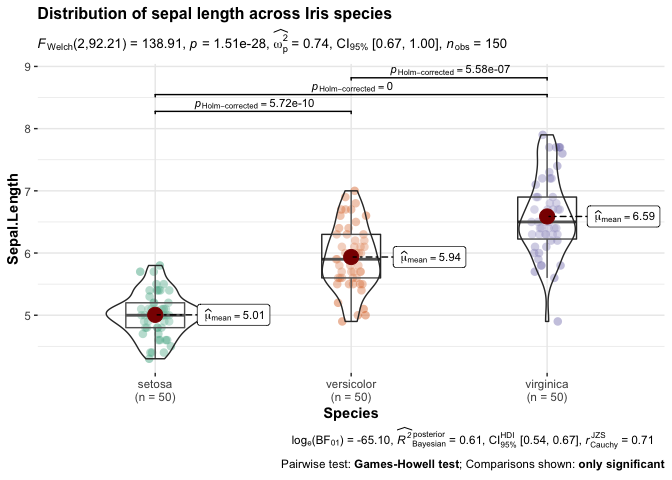
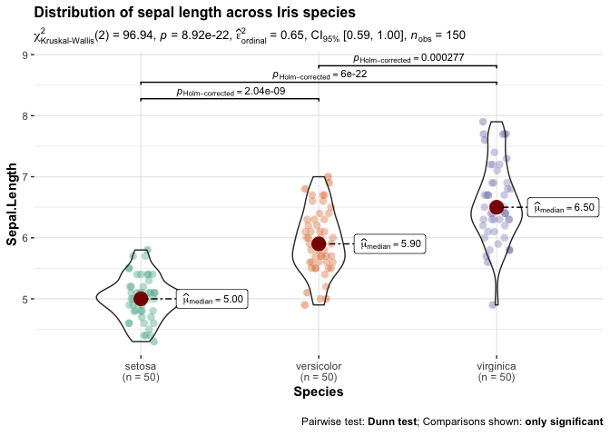
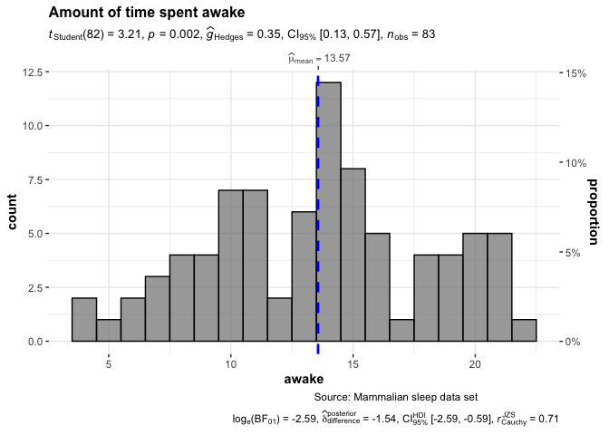
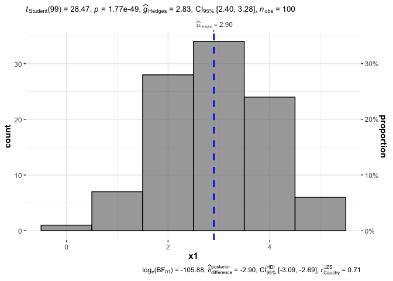
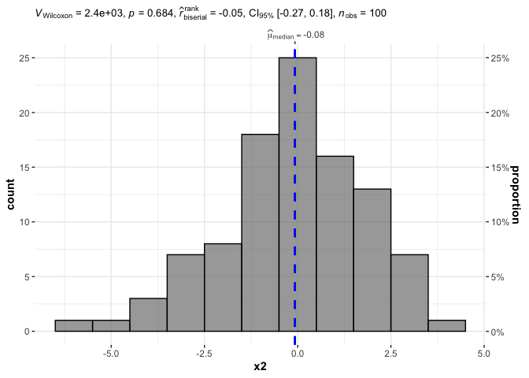
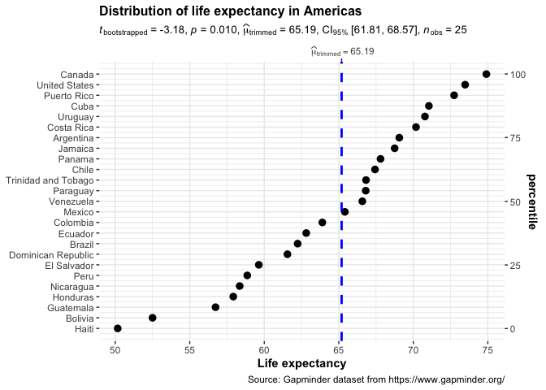
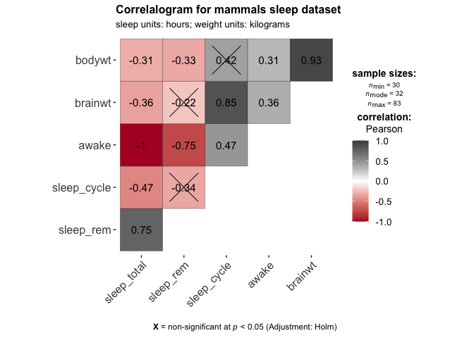
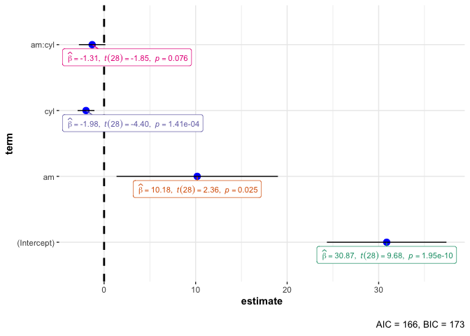

ggplot2: Statistical Annotation
================
ggSeminar
Fall 2021

## Statistical Annotation

Often you may want or need to include statistical annotation with a
ggplot object. There may be motivations to combine statistical
information in plots during exploratory work, or for final
presentations.

This tutorial will focus on `ggstatsplot`; however, other packages, such
as `ggpubr` exist and may be useful. And as another disclaimer, much of
the language used in these functions refers to statistical concepts and
may not be familiar to everyone. Because we are interested in the plots,
we will not have the time to fully explain or study all the statistical
extensions available.

Some packages you need to load (and may need to download):

``` r
library(tidyverse)
library(ggstatsplot)
library(gapminder)
library(ggcorrplot)
```

The `ggstatsplot`
[website](https://github.com/IndrajeetPatil/ggstatsplot) is a great
resource, highlighted by tables of plots and statistical analyses that
the package implement. Also please take note of the **Statistical
Reporting** section (just below the tables) to help describe the output
from the function calls.

Let’s try the `ggbetweenstats` functions first.

``` r
## plot
ggbetweenstats(
  data  = iris,
  x     = Species,
  y     = Sepal.Length,
  title = "Distribution of sepal length across Iris species"
)
```

<!-- -->

This plot returns a lot of information! Let’s dissect this example.

-   The top line is the title, which is reflected in the code
-   The second line is the summary from the Frequentist analysis, which
    is reporting a Welch’s test, test statistic, *p*-value, etc.
-   Next is the actual plot, showing the data with means reported and
    pairwise comparisons at the top
-   Below the plot are the results from a Bayesian analysis, which we
    will largely skip over at this time
-   The final line at the bottom states the pairwise comparison test and
    criteria for showing them

If you review the package tutorial, you will next see an example in
which the default are examined or overridden. We will skip that specific
example and instead build one of our own using the above example.

``` r
## plot
ggbetweenstats(
  data  = iris,
  x     = Species,
  y     = Sepal.Length,
  title = "Distribution of sepal length across Iris species",
  plot.type = "violin",
  type = "nonparametric"
)
```

<!-- -->

A companion function to `ggbetweenstats` is `ggwithinstats`, which is
similar enough that we won’t cover it here. Basically, `ggwithinstats`
is testing *within* a factor, such as in a repeated measures type of
design.

`gghistostats` is the next function and is likely to be very useful. As
the name implies, a histogram is used to examine one variable, which can
also be tested for a difference from a specified value (e.g., 0).

``` r
## plot
gghistostats(
  data       = ggplot2::msleep, ## dataframe houding variable
  x          = awake, ## numeric variable whose distribution is of interest
  title      = "Amount of time spent awake", ## title for the plot
  caption    = "Source: Mammalian sleep data set",
  test.value = 12, ## default value is 0
  binwidth   = 1 ## binwidth value (experiment)
)
```

<!-- -->

Basically, you can use this function to test a variable against a test
value. Again, let’s skip the highly customized example in the package
tutorial and tinker with our own example. Let’s create a dataframe
(required) that holds `x1` and `x2`, the former which should not include
0 and the latter which should include 0.

``` r
x1 <- rnorm(100, mean = 3, sd = 1)
x2 <- rnorm(100, mean = 0, sd = 2)
df <- data.frame(x1, x2)
gghistostats(
  data       = df, ## dataframe houding variable
  x          = x1, ## numeric variable whose distribution is of interest
  test.value = 0, ## default value is 0
  binwidth   = 1 ## binwidth value (experiment)
)
```

<!-- -->

And now `x2`

``` r
gghistostats(
  data       = df, ## dataframe houding variable
  x          = x2, ## numeric variable whose distribution is of interest
  type       = 'nonparametric',
  test.value = 0, ## default value is 0
  binwidth   = 1 ## binwidth value (experiment)
)
```

<!-- -->

`ggdotplotstats` is a function for when the numeric value also has a
label. Let’s try a reduced example (based on the tutorial).

``` r
## plot
ggdotplotstats(
  data       = dplyr::filter(gapminder::gapminder, continent == "Americas"),
  y          = country,
  x          = lifeExp,
  test.value = 70,
  type       = "robust",
  title      = "Distribution of life expectancy in Americas",
  xlab       = "Life expectancy",
  caption    = "Source: Gapminder dataset from https://www.gapminder.org/"
)
```

<!-- -->

Correlations are another statistical test that often benefits from
visualization. `ggcorrmat` is a function that can visualize and report
correlation statistics.

``` r
ggcorrmat(
  data     = ggplot2::msleep,
  colors   = c("#B2182B", "white", "#4D4D4D"),
  title    = "Correlalogram for mammals sleep dataset",
  subtitle = "sleep units: hours; weight units: kilograms"
)
```

<!-- -->

Correlation plots are sometimes, but often not, used in final reports
and publications; however, they remain a very important statistical
tool. This correlation function is useful (although there several R
libraries for correlations), but what I find particularly informative is
the crossing out of non-significant correlations because significance
does not perfectly correlated with correlation coefficient.

The last function we will review is the `ggcoefstats`, which is a way of
plotting model coefficients. Let’s check it out.

``` r
## model
mod <- stats::lm(formula = mpg ~ am * cyl, data = mtcars)

## plot
ggcoefstats(mod)
```

<!-- -->

``` r
summary(mod)
```

    ## 
    ## Call:
    ## stats::lm(formula = mpg ~ am * cyl, data = mtcars)
    ## 
    ## Residuals:
    ##     Min      1Q  Median      3Q     Max 
    ## -6.5255 -1.2820 -0.0191  1.6301  5.9745 
    ## 
    ## Coefficients:
    ##             Estimate Std. Error t value Pr(>|t|)    
    ## (Intercept)  30.8735     3.1882   9.684 1.95e-10 ***
    ## am           10.1754     4.3046   2.364 0.025258 *  
    ## cyl          -1.9757     0.4485  -4.405 0.000141 ***
    ## am:cyl       -1.3051     0.7070  -1.846 0.075507 .  
    ## ---
    ## Signif. codes:  0 '***' 0.001 '**' 0.01 '*' 0.05 '.' 0.1 ' ' 1
    ## 
    ## Residual standard error: 2.939 on 28 degrees of freedom
    ## Multiple R-squared:  0.7852, Adjusted R-squared:  0.7621 
    ## F-statistic: 34.11 on 3 and 28 DF,  p-value: 1.73e-09

### Takeaway

I am overall impressed by the integration and performance of functions
that carry out statistical models and data visualizations in one
function. These are powerful function and likely to improve with future
versions. However, personally I will likely continue to run statistical
analyses and data visualizations separately because of the extreme
amount of customization that each has on its own. I do not discourage
the use of hybrid stats-plotting functions, but I would caution that
they don’t become a crutch or a default for you.
